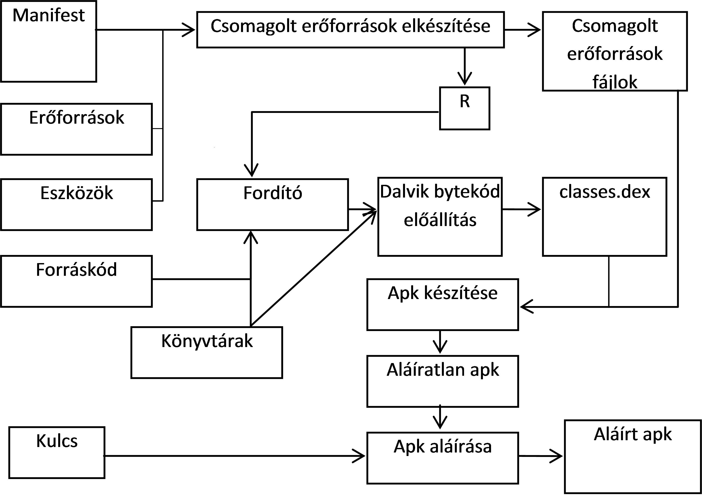
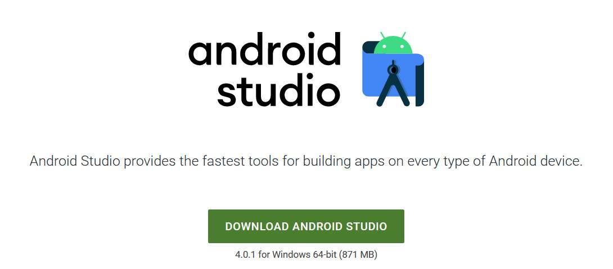
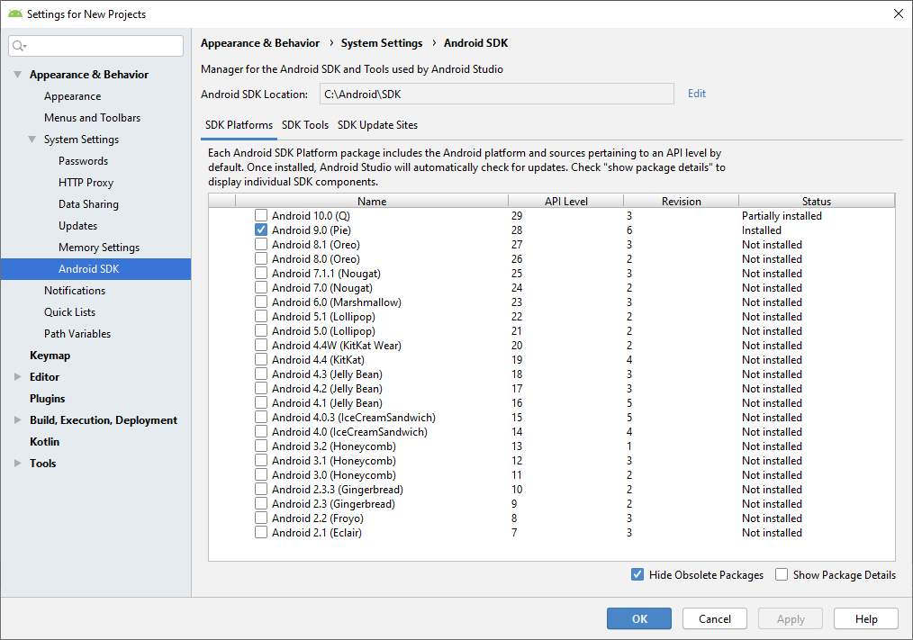
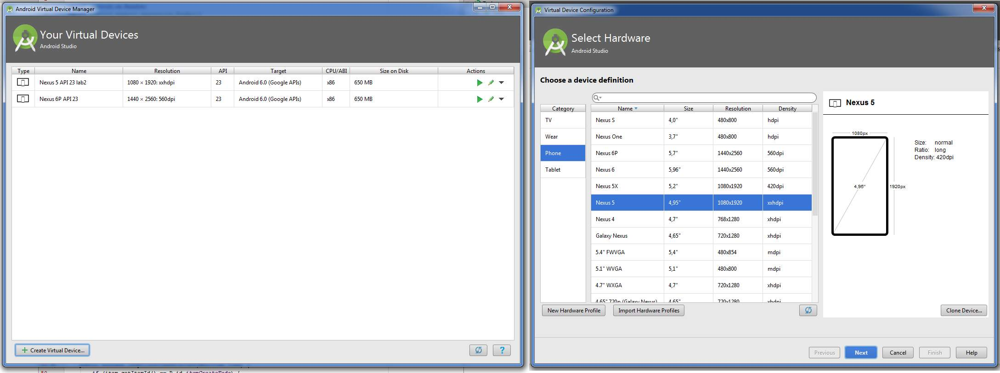
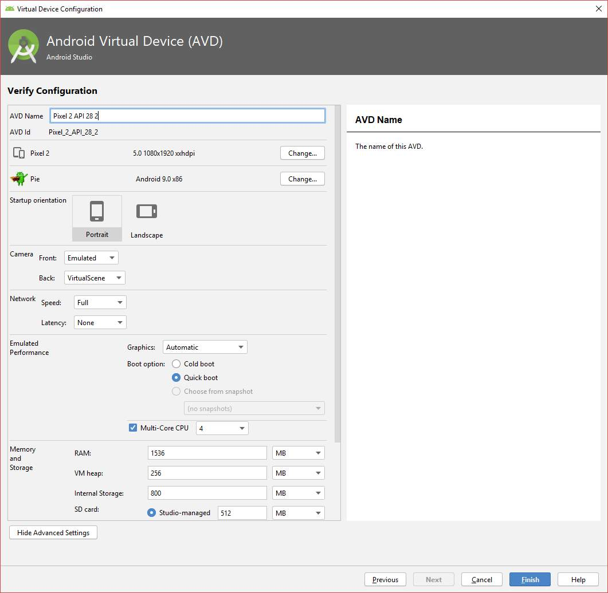
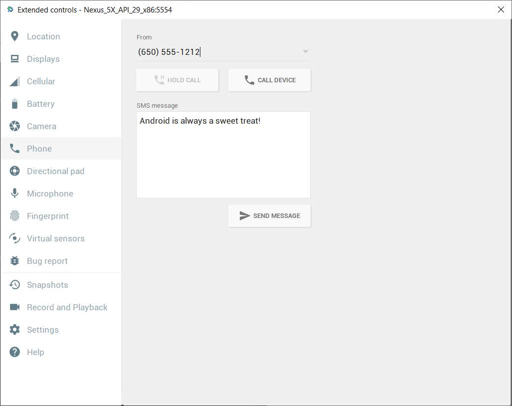
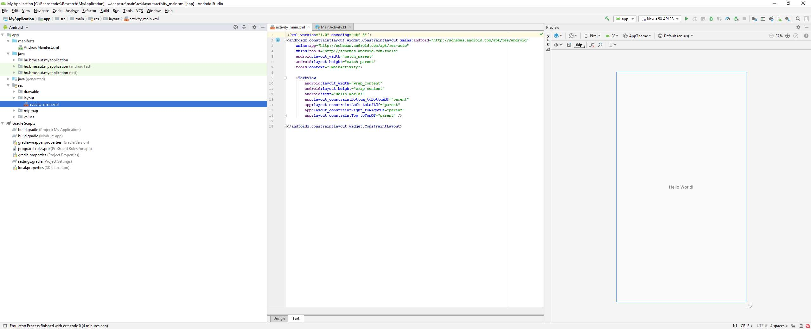
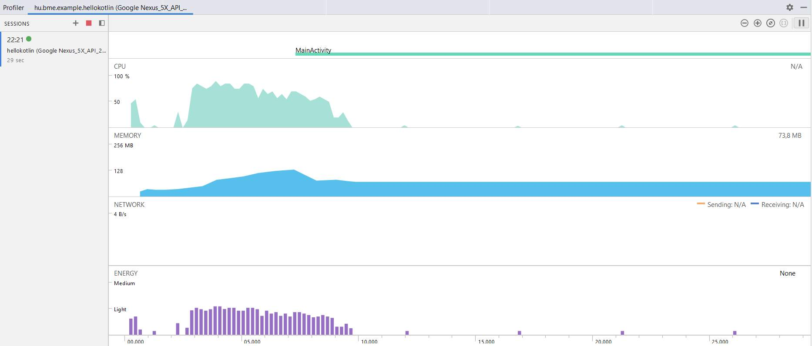
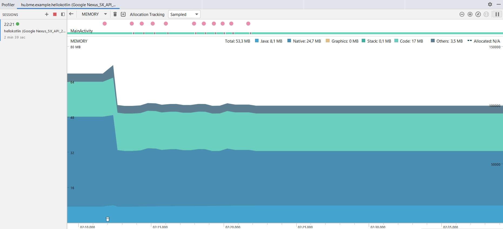

# Labor 01 - Hello World

## Általános tudnivalók

### iMSC pontok

iMSC pontok a ZH-n, a nagyHF-n és várhatóan néhány laboron szerezhetők. Az első laboron nem szerezhető iMSc pont. A későbbi laborokon, ha lesz ilyen lehetőség, az iMSc-s feladatok megoldásait az AUT portálra kell feltölteni ugyanúgy a megfelelő labor alá, de érdemes megjegyzésként odaírni, hogy mely iMSc feladatok lettek megoldva. Ha egy feladatban kérdések szerepelnek, a pontok csak akkor fogadhatók el, ha mellékletben egy igényes jegyzőkönyv is szerepel a kérdésekre vonatkozó válaszokkal. iMSc pont szerzésére bármely hallgató jogosult, aki az előtte lévő feladatokkal már végzett (laborvezető ellenőrzi a haladást).

### Laborok értékelése

Minden labor leírása tartalmazza, hogy mi a megoldandó feladat. A megoldásokat minden esetben az AUT portálra kell feltölteni.

### Beugró

Az első labort kivéve minden labor előtt lesz beugró, mely feltétele a labor teljesítésének.

### Kis ZH-k

A félév során hat alkalommal kis zárthelyit íratunk a laboratórium alkalmakon. Ezek közül a négy legjobban sikerült kis zárthelyi pontszámnak egyenként el kell érje a szerezhető pontszám 40%-át. A KisZH kiváltja a beugró szerepét.

A kisZH-k kettő vagy három hetente lesznek, ezek időpontját az első vagy második előadáson kihirdetjük. A mostani Labor 01-en nincs kisZH.

## Android alapok

A labor célja, hogy bemutassa az Android fejlesztőkörnyezetet, az alkalmazáskészítés, illetve a tesztelés és fordítás folyamatát, az alkalmazás felügyeletét, valamint az emulátor és a fejlesztőkörnyezet funkcióit. Ismertetjük egy Hello World alkalmazás elkészítésének módját és labor során a laborvezető részletesen bemutatja az eszközöket.

A labor az alábbi témákat érinti:

*   Az Android platform alapfogalmainak ismerete
*   Android Studio fejlesztőkörnyezet alapok
*   Android Emulátor tulajdonságai
*   Android projekt létrehozása és futtatása emulátoron
*   Manifest állomány felépítése
*   Android Profiler

### Fordítás menete Android platformon

A projekt létrehozása után a forráskód az `src` könyvtárban, míg a felhasználói felület leírására szolgáló XML állományok a `res` könyvtárban találhatók. Az erőforrás állományokat egy `R.java` állomány köti össze a forráskóddal, így könnyedén elérhetjük Java/Kotlin oldalról az XML-ben definiált felületi elemeket. Az Android projekt fordításának eredménye egy APK állomány, melyet közvetlenül telepíthetünk mobil eszközre.

1.  A fejlesztő elkészíti a Kotlin forráskódot, valamint az XML alapú felhasználói felület leírást a szükséges erőforrás állományokkal.

2.  A fejlesztőkörnyezet az erőforrás állományokból folyamatosan naprakészen tartja az `R.java` erőforrás fájlt a fejlesztéshez és a fordításhoz. **FONTOS: az `R.java` állomány generált, kézzel SOHA ne módosítsuk!** (Az Android Studio egyébként nem is hagyja.)

3.  A fejlesztő a Manifest állományban beállítja az alkalmazás hozzáférési jogosultságait (pl. Internet elérés, szenzorok használata, stb.), illetve ha futás idejű jogosultságok szükségesek, ezt kezeli.

4.  A fordító a forráskódból, az erőforrásokból és a külső könyvtárakból előállítja a Dalvik/[**ART**](https://hu.wikipedia.org/wiki/Android_Runtime) virtuális gép gépi kódját.

5.  A gépi kódból és az erőforrásokból előáll a nem aláírt APK állomány.

6.  Végül a rendszer végrehajtja az aláírást és előáll a készülékekre telepíthető, aláírt APK.

*Fordítás menete Android platformon*

Az Android Studio a [Gradle](https://gradle.org/) build rendszert használja ezeknek a lépéseknek az elvégézéséhez.

**Megjegyzések:**

*   A teljes folyamat a fejlesztői gépen megy végbe, a készülékekre már csak bináris állomány jut el.

*   A külső könyvtárak általában JAR állományként, vagy egy másik projekt hozzáadásával illeszthetők az aktuális projekthez (de ezt nem kell kézzel megtennünk, a függőségek kezelésében is a Gradle fog segíteni).

*   Az APK állomány leginkább a Java világban ismert JAR állományokhoz hasonlítható.

*   A Manifest állományban meg kell adni a támogatni kívánt Android verziót, mely felfele kompatibilis az újabb verziókkal, ennél régebbi verzióra azonban az alkalmazás már nem telepíthető.

*   Az Android folyamatosan frissülő verzióival folymatosan lépést kell tartaniuk a fejlesztőknek.

*   Az Android alkalmazásokat tipikusan a Google Play Store-ban szokták publikálni, így az APK formátumban való terjesztés nem annyira elterjedt.

### SDK és könyvtárai

A [developer.android.com/studio](https://developer.android.com/studio) oldalról letölthető az IDE és az SDK. Ennek fontosabb mappáit, eszközeit tekintsék át a laborvezető segítségével!

SDK szerkezet:

*   `docs:` Dokumentáció
*   `extras:` Különböző extra szoftverek helye. Maven repository, support libes anyagok, analytics SDK, Google [Android USB driver](https://developer.android.com/studio/run/win-usb.html) (amennyiben SDK managerrel ezt is letöltöttük) stb.
*   `platform-tools:` Fastboot és ADB binárisok helye (legtöbbet használt eszközök)
*   `platforms`, `samples`, `sources`, `system-images:` Minden API levelhez külön almappában a platform anyagok, források, példaprojektek, OS image-ek
*   `tools:` Fordítást és tesztelést segítő eszközök, SDK manager, 9Patch drawer, emulátor binárisok stb.

### AVD és SDK manager

Az SDK kezelésére az SDK managert használjuk, ezzel lehet letölteni és frissen tartani az eszközeinket. Indítása az Android Studion keresztül lehetséges.

Az SDK Manager ikonja a fenti toolbaron:

SDK manager felülete:

*Megjegyzés: Korábban létezett egy standalone SDK manager de ennek használata mára deprecated lett. Ha online forrásokban ilyet látunk ne lepődjünk meg.*

Indítsuk el, és vizsgáljuk meg a laborvezetővel, rendelkezésre áll-e minden, ami az első alkalmazásunkhoz kelleni fog.

### AVD

Az AVD az Android Virtual Device rövidítése. Ahogy arról már előadáson is szó esett, nem csak valódi eszközön futtathatjuk a kódunkat, hanem emulátoron is. (Mi is a különbség szimulátor és emulátor között?) Az AVD indítása a fejlesztői környezeten keresztül lehetséges (illetve parancssorból is, de ennek a használatára csak speciális esetekben van szükség).

Az AVD Manager ikonja:

A fenti képen bal oldalon a létező virtuális eszközök listáját találjuk, jobb oldalon pedig az ún. eszköz definíciókét. Itt néhány előre elkészített sablon áll rendelkezésre. Magunk is készíthetünk ilyet, ha tipikusan egy adott eszközre szeretnénk fejleszteni (pl. Galaxy S4). Készítsünk új emulátort! Értelemszerűen csak olyan API szintű eszközt készíthetünk, amilyenek rendelkezésre állnak az SDK manageren keresztül.

1. A bal oldali ablakon, kattintsunk a bal alsó sarokban található *Create Virtual Device...* gombra!
2. Válasszunk az előre definiált készülék sablonokból (pl. *Nexus 5X*), majd nyomjuk meg a *Next* gombot.
3. Döntsük el, hogy milyen Android verziójú emulátort kívánunk használni. CPU/ABI alapvetően x86_64 legyen, mivel ezekhez kapunk [hardveres gyorsítást](https://developer.android.com/studio/run/emulator-acceleration) is. Itt válasszunk a rendelkezésre állók közül egyet, majd *Next*.
4. Az eszköz részletes konfigurációja.

    - A virtuális eszköz neve legyen például `Labor_0`.
    - Válasszuk ki az alapértelmezett orientációt, tetszés szerint kapcsoljuk ki vagy be a készülék keretének megjelenítését.

    A *Show Advanced Settings* alatt további opciókat találunk:

    - Kamera opciók:
        - *WebcamX*, hardveres kamera, ami a számítógépre van csatlakoztatva
        - *Emulated*, egy egyszerű szoftveres megoldás, **most legalább az egyik kamera legyen ilyen**.
        - *VirtualScene*, egy kifinomultabb szoftveres megoldás, amelyben egy 3D világban mozgathatjuk a kamerát.
    - *Boot Option*: Nemrég jelent meg az Android emulátor állapotáról való pillanatkép elmentésének lehetősége. Ez azt takarja, hogy a virtuális operációs rendszer csak felfüggesztésre kerül az emulátor bezáráskor (például a megnyitott alkalmazás is megmarad, a teljes állapotával), és *Quick boot* esetben a teljes OS indítása helyett másodperceken belül elindul az emulált rendszer. *Cold Boot* esetben minden alkalommal leállítja és újra indítja a virtális eszköz teljes operációs rendszerét.
    - Memória és tárhely: 
        - RAM: Ha kevés a rendszermemóriánk, nem érdemes 768 MB-nál többet adni, mert könnyen futhatunk problémákba. Ha az emulátor lefagy, vagy az egész OS megáll működés közben, akkor állítsuk alacsonyabbra ezt az értéket. 8 GB vagy több rendszermemória mellett nyugodtan állíthatjuk az emulátor memóriáját 1024, 1536, vagy 2048 MB-ra.
        - VM heap: az alkalmazások virtuális gépének szól, maradhat az alapérték. Tudni kell, hogy készülékek esetében gyártónként változik.
        - Belső flash memória és SD kártya mérete, alapvetően jók az alapértelmezett beállításai.

    - Ha mindent rendben talál az ablak, akkor *Finish*!

Az Android Virtual Device Manager-ben megjelent az imént létrehozott eszközünk. Itt lehetőség van a korábban megadott paraméterek szerkesztésére, a "készülékről" a felhasználói adatok törlésére (*Wipe Data* - Teljes visszaállítás), illetve az emulátor példány duplikálására vagy törlésére.

A Play gombbal indítsuk el az új emulátort!

Az elindított emulátoron próbáljuk ki az *API Demos* és *Dev Tools* alkalmazásokat!

Megjegyzés: A gyári emulátoron kívül több alternatíva is létezik, a [Genymotion](https://www.genymotion.com/fun-zone/) ezek közül az egyik legjobb, viszont a Google féle emulátor a legelterjedtebb, így amennyiben ezzel nem jelentkeznek problémáink, maradjunk ennél.

Tesztelés céljából nagyon jól használható az emulátor, amely az alábbi képen látható plusz funkciókat is adja. Lehetőség van többek között egyedi hely beállítására, bejövő hívás szimulálására, stb. A panelt a futó emulátor jobb oldalán található vezérlő gombok közül a *...* gombbal lehet megnyitni:

## Fejlesztői környezet

 Android fejlesztésre a labor során a JetBrains IntelliJ alapjain nyugvó Android Studio-t fogjuk használni. A Studio-val ismerkedők számára hasznos funkció a *Tip of the day*, érdemes egyből kipróbálni, megnézni az adott funkciót. Induláskor alapértelmezetten a legutóbbi projekt nyílik meg, ha nincs ilyen, vagy ha minden projektünket bezártuk, akkor a nyitó képernyő. (A legutóbbi projekt újranyitását a *Settings -> Appeareance & Behavior -> System Settings -> Reopen last project on startup* opcióval ki is kapcsolhatjuk.)

## Hello World

A laborvezető segítségével készítsenek egy egyszerű Hello World alkalmazást, a varázsló nézeten az *Include Kotlin support* legyen bepipálva!

### Android Studio

Ez a rész azoknak szól, akik korábban már használták az Eclipse nevű IDE-t, és szeretnék megismerni a különbségeket az Android Studio-hoz képest.

*   **Import régi projektekből:** Android Studioban lehetséges a projekt
    importálása régebbi verziójú projektekből és a régi Eclipse
    projektekből is.
*   **Projektstruktúra:** A Studio Gradle-lel fordít, és más felépítést
    használ. Projekten belül:
    *   `.idea`: IDE fájlok
    *   `app`: forrás
        *   `build`: fordított állományok
        *   `libs`: libraryk
        *   `src`: forráskód, azon belül is külön projekt a tesztnek, és azon belül pedig `res` könyvtár, illetve `java`. Utóbbin belül már a csomagok vannak.
    *   `gradle`: Gradle fájlok

*   **Hasznos funkciók:**
    *   IntelliSense, fejlett refaktorálás támogatás
    *   Ha egy sorban színre, vagy képi erőforrásra hivatkozunk, a sor elejére kitesz egy miniatűr változatot.
    *   Ha közvetve hivatkozott erőforrást (akár `resources.get...`, akár `R...`) adunk meg, összecsukja a hivatkozást és a tényleges értéket mutatja. Ha rávisszük az egeret felfedi, ha kattintunk kibontja a hivatkozást.
    *   Névtelen belső osztályokkal is hasonlót tud, javítva a kód olvashatóságát.
    *   Kódkiegészítésnél szabad a kereső, a szótöredéket keresi, nem pedig a szóval kezdődő lehetőségeket (lásd képen)
    *   Változónév ajánlás: amikor változónévre van szükségünk, nyomjunk *Ctrl+Space*-t. Ha adottak a körülmények, a Studio egész jó neveket tud felajánlani.
    *   Szigorú lint. A Studio megengedi a warningot. Ezért szigorúbb a lint, több mindenre figyelmeztet (olyan apróságra is, hogy egy View egyik oldalán van padding, a másikon nincs)
    *   Layout szerkesztés. A grafikus layout építés lehetséges.
    *   CTRL-t lenyomva navigálhatunk a kódban, pl. osztályra, metódushívásra kattintva. Ezt a navigációt (és az egyszerű másik osztályba kattintást is) rögzíti, és a historyban előre-hátra gombokkal lehet lépkedni. Ha van az egerünkön/billentyűzetünkön ilyen gomb, és netes böngészés közben aktívan használjuk, ezt a funkciót nagyon hasznosnak fogjuk találni.
    *   Szín ikonja a sor elején; kiemelve jobb oldalon, hogy melyik nézeten vagyunk; szabadszavas kiegészítés; a "Hello world" igazából `@string/very_very_very_long_hello_world`.*

### Billentyűkombinációk

*   <kbd>CTRL</kbd> + <kbd>ALT</kbd> + <kbd>L</kbd>: Kódformázás
*   <kbd>CTRL</kbd> + <kbd>SPACE</kbd>: Kódkiegészítés
*   <kbd>SHIFT</kbd> + <kbd>F6</kbd> Átnevezés (Mindenhol)
*   <kbd>F2</kbd>: A következő error-ra ugrik. Ha nincs error, akkor warningra.
*   <kbd>CTRL</kbd> + <kbd>Z</kbd> illetve <kbd>CTRL</kbd> + <kbd>SHIFT</kbd> + <kbd>Z</kbd>: Visszavonás és Mégis
*   <kbd>CTRL</kbd> + <kbd>P</kbd>: Paraméterek mutatása
*   <kbd>ALT</kbd> + <kbd>INSERT</kbd>: Metódus generálása
*   <kbd>CTRL</kbd> + <kbd>O</kbd>: Metódus felüldefiniálása
*   <kbd>CTRL</kbd> + <kbd>F9</kbd>: Fordítás
*   <kbd>SHIFT</kbd> + <kbd>F10</kbd>: Fordítás és futtatás
*   <kbd>SHIFT</kbd> <kbd>SHIFT</kbd>: Keresés mindenhol
*   <kbd>CTRL</kbd> + <kbd>N</kbd>: Keresés osztályokban
*   <kbd>CTRL</kbd> + <kbd>SHIFT</kbd> + <kbd>N</kbd>: Keresés fájlokban
*   <kbd>CTRL</kbd> + <kbd>ALT</kbd> + <kbd>SHIFT</kbd> + <kbd>N</kbd>: Keresés szimbólumokban (például függvények, property-k)
*   <kbd>CTRL</kbd> + <kbd>SHIFT</kbd> + <kbd>A</kbd>: Keresés a beállításokban, kiadható parancsokban.

### Eszközök, szerkesztők

A *View* menü *Tool Windows* menüpontjában lehetőség van különböző ablakok ki- és bekapcsolására. Laborvezető segítségével tekintsék át az alábbi eszközöket!

*   Project
*   Structure
*   TODO
*   Logcat
*   Terminal
*   Event Log
*   Gradle

Lehetőség van felosztani a szerkesztőablakot, ehhez kattinsunk egy megnyitott fájl tabfülére jobb gombbal, *Split Vertically/Horizontally*!

### Hasznos beállítások

A laborvezető segítségével állítsák be a következő hasznos funkciókat:

*   kis- nagybetű érzékenység kikapcsolása a kódkiegészítőben (settingsben keresés: *sensitive*)
*   "laptop mód" ki- és bekapcsolása (*File -> Power Save Mode*)
*   sorszámozás bekapcsolása (kód melletti részen bal oldalt: jobb egérgomb, *Show Line Numbers*)
*   beírás közbeni autoimport bekapcsolása (settingsben keresés: import, utána Editor/Auto import)

### Generálható elemek

A Studio sok sablont tartalmaz, röviden tekintsék át a lehetőségeket:

*   Projektfában, projektre jobb gombbal kattintva -> New -> Module
*   Projektfában, modulon belül, "java"-ra kattintva jobb gombbal -> New
*   Forráskódban <kbd>ALT</kbd>+<kbd>INSERT</kbd> billentyűkombinációra

## Android Profiler

A készülék erőforráshasználata [monitorozható](https://developer.android.com/studio/profile/android-profiler) ezen a felületen, amelyet az említett *View -> Tool Windows*-ból érhetünk el.

Például részletes információt kaphatunk a memória használatról:

## Feladatok:

1.  Az új alkalmazást futtassák emulátoron (akinek saját készüléke van, az is próbálja ki)!
2.  Helyezzenek breakpointot a kódba, és debug módban indítsák az alkalmazást! (Érdemes megyfigyelni, hogy most másik Gradle Task fut a képernyő alján.)
3.  Indítsanak hívást és küldjenek SMS-t az emulátorra! Mit tapasztalnak?
4.  Indítsanak hívást és küldjenek SMS-t az emulátorról! Mit tapasztalnak?
5.  Tekintse át az Android Profiler nézet funkcióit a laborvezető segítségével!
6.  Változtassa a készülék pozícióját az emulátor megfelelő paneljének segítségével!
7.  Vizsgálja meg az elindított `HelloWorld` projekt nyitott szálait, memóriafoglalását!
8.  Vizsgálja meg a Logcat panel tartalmát!
9.  Vizsgálja meg az Analyze -> Inspect code eredményét!
10.  Keresse ki a létrehozott `HelloWorld` projekt mappáját és a build könyvtáron belül vizsgálja meg az `.apk` állomány tartalmát! Hol található a lefordított kód? 