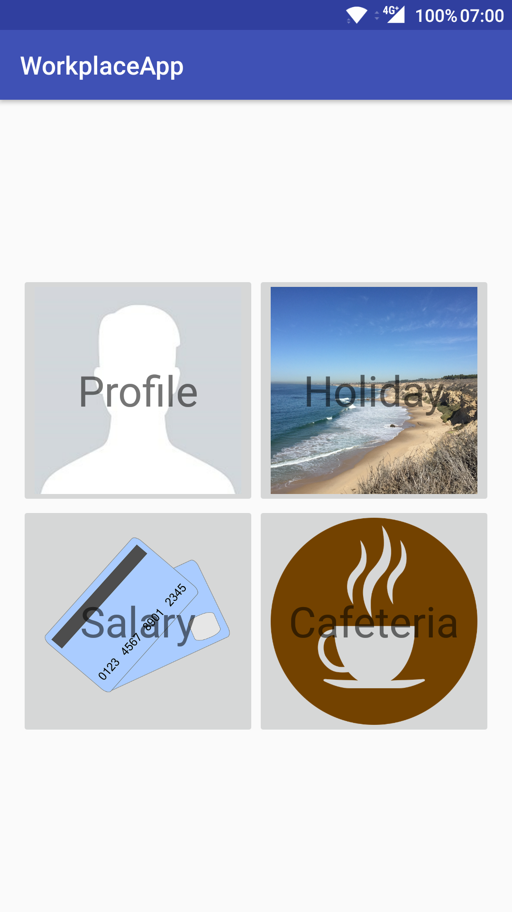
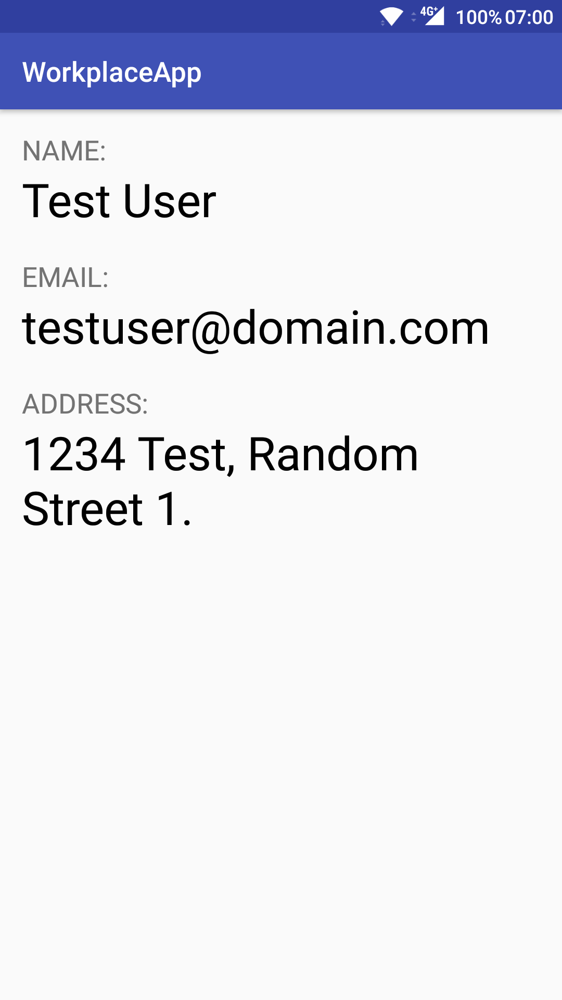
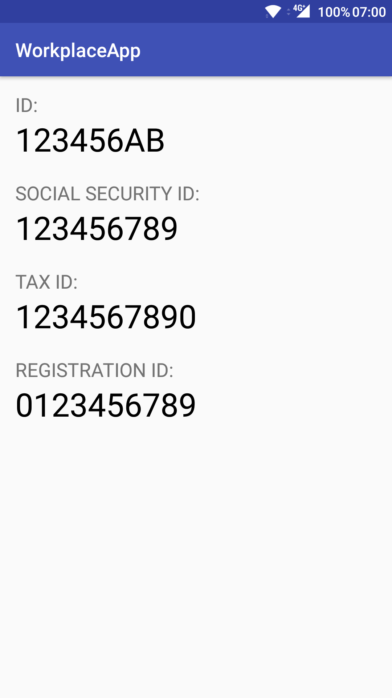
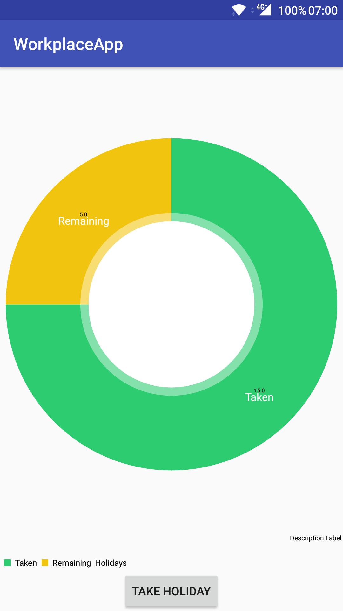
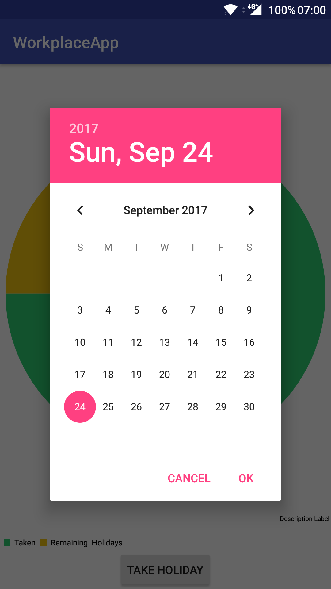

# Labor 04 - Felhasználói felület készítése - Fragmentek, Chartok

## Bevezető

A labor során egy HR alkalmazást készítünk el, amelybe belépve a felhasználó meg tudja tekinteni személyes adatait, illetve szabadságot tud rögzíteni. Az alkalmazás nem használ perzisztens adattárolást és valós bejelentkeztetést, csak demo adatokkal dolgozik. A labor fő témája a Fragmentekkel való felületkészítés lesz.

<p align="center">





</p>

## IMSc pontok

A laborfeladatok sikeres befejezése után az IMSc feladatot megoldva 2 IMSc pont szerezhető.

## Értékelés

Osztályzás:
- Főmenü képernyő: 1 pont
- Profil képernyő: 1 pont
- Szabadság képernyő: 1 pont
- Dátumválasztó, napok csökkentése: 1 pont
- Önálló feladat (szabadság továbbfejlesztése): 1 pont

IMSc: Fizetés menüpont megvalósítása
- Kördiagram: 1 IMSc pont
- Oszlopdiagram: 1 IMSc pont

## Projekt létrehozása

Hozzunk létre egy új Android projektet! Az alkalmazás neve legyen `WorkplaceApp`, a Package name pedig `hu.bme.aut.workplaceapp`.

Az alkalmazást természetesen telefonra készítjük, és használhatjuk az alapértelmezett 21-ös minimum SDK szintet.

Az első Activity-nk legyen egy Empty Activity, és nevezzük el `MenuActivity`-nek. A hozzá tartozó layout fájl automatikusan megkapja az `activity_menu.xml` nevet.

Előzetesen töltsük le az alkalmazás képeit tartalmazó [tömörített fájlt](./downloads/res.zip) és bontsuk ki. A benne lévő drawable könyvtárat másoljuk be az app/src/main/res mappába (Studio-ban res mappán állva `Ctrl+V`).

## Főmenü képernyő

Az első Activity amit elkészítünk a navigációért lesz felelős. A labor során 2 funkciót fogunk megvalósítani, ezek a Profil és a Szabadság.

A projekt készítésekor már létrejött `activity_menu.xml` tartalmát cseréljük ki az alábbira:

```xml
<?xml version="1.0" encoding="utf-8"?>
<LinearLayout xmlns:android="http://schemas.android.com/apk/res/android"
    android:layout_width="match_parent"
    android:layout_height="match_parent"
    android:layout_margin="16dp"
    android:gravity="center"
    android:orientation="vertical">

    <LinearLayout
        android:layout_width="match_parent"
        android:layout_height="wrap_content"
        android:orientation="horizontal">

        <FrameLayout
            android:layout_width="0dp"
            android:layout_height="wrap_content"
            android:layout_weight="1">

        </FrameLayout>

        <FrameLayout
            android:layout_width="0dp"
            android:layout_height="wrap_content"
            android:layout_weight="1">

        </FrameLayout>
    </LinearLayout>

    <LinearLayout
        android:layout_width="match_parent"
        android:layout_height="wrap_content"
        android:orientation="horizontal">

        <FrameLayout
            android:layout_width="0dp"
            android:layout_height="wrap_content"
            android:layout_weight="1">

        </FrameLayout>

        <FrameLayout
            android:layout_width="0dp"
            android:layout_height="wrap_content"
            android:layout_weight="1">

        </FrameLayout>

    </LinearLayout>

</LinearLayout>
```

Egy függőleges LinearLayout-ba tettünk bele 2 vízszintes LinearLayout-ot, mindkettő 2 gombot fog tartalmazni. Súlyozás segítségével 2 részre osztottuk a vízszintes LinearLayout-okat.
A gombon a háttér és a felirat elhelyezéséhez a korábbi laboron már látotthoz hasonlóan FrameLayout-ot fogunk használni.

Az első gombot például így készíthetjük el (a `FrameLayout` tagbe írjuk):
```xml
<ImageButton
    android:id="@+id/btnProfile"
    android:layout_width="match_parent"
    android:layout_height="match_parent"
    android:adjustViewBounds="true"
    android:scaleType="fitCenter"
    android:src="@drawable/profile" />

<TextView
    android:layout_width="wrap_content"
    android:layout_height="wrap_content"
    android:layout_gravity="center"
    android:text="Profile"
    android:textSize="34sp" />
```

A további 3 gombot ennek a mintájára készítsük el ezekkel az értékekkel:

| Szöveg | ID | Kép |
| -- | -- | -- |
| Holiday | `@+id/btnHoliday` | `@drawable/holiday` |
| Payment | `@+id/btnPayment` | `@drawable/payment` |
| Cafeteria | `@+id/btnCafeteria` | `@drawable/cafeteria` |

Ne felejtsük el a szövegeket kiszervezni erőforrásba! (a szövegen állva `Alt+Enter`)

Hozzunk létre a két új Empty Activity-t (`ProfileActivity` és `HolidayActivity`)

Hivatkozzuk be a projekthez a view binding-ot. A modul szintű gradle fájlba addjuk hozzá:

```
android {
    ...
    buildFeatures {
        viewBinding true
    }
}
```

Használjuk a view binding-ot a MenuActivity-ben:

```kotlin
private lateinit var binding : ActivityMenuBinding

override fun onCreate(savedInstanceState: Bundle?) {
    super.onCreate(savedInstanceState)
    binding = ActivityMenuBinding.inflate(layoutInflater)
    setContentView(binding.root)
        
}
```

A MenuActivity Kotlin fájljában (`MenuActivity.kt`) rendeljünk a gombok lenyomásához eseménykezelőt az onCreate metódusban:

```kotlin
binding.btnProfile.setOnClickListener {
    val profileIntent = Intent(this, ProfileActivity::class.java)
    startActivity(profileIntent)
}

binding.btnHoliday.setOnClickListener { 
    val holidayIntent = Intent(this, HolidayActivity::class.java)
    startActivity(holidayIntent)
}
```

Próbáljuk ki az alkalmazást! 4 gombnak kell megjelennie és a felső kettőn működnie kell a navigációnak a (még) üres Activity-kbe.

## Profil képernyő elkészítése

A Profil képernyő két lapozható oldalból fog állni, ezen a név, email, lakcím (első oldal), illetve a személyigazolvány szám, TAJ szám, adószám és törzsszám (második oldal) fognak megjelenni.

Hozzunk létre egy `data` package-et, azon belül egy `Person` adatosztályt, ebben fogjuk tárolni az oldalakon megjelenő adatokat.
Az adat típusú osztályok esetében a Kotlin automatikusan deklarál gyakran használt függvényeket, mint például az `equals()` és `hashCode()` függvényeket különböző objektumok összehasonlításához, illetve egy `toString()` függvényt, mely visszaadja a tárolt változók értékét.

```kotlin
data class Person(
    val name: String,
    val email: String,
    val address: String,
    val id: String,
    val socialSecurityNumber: String,
    val taxId: String,
    val registrationId: String
)
```

A Person osztály példányának elérésére hozzunk létre egy `DataManager` osztályt (szintén a `data` package-en belül), ezzel fogjuk szimulálni a valós adatelérést (Singleton mintát használunk, hogy az alkalmazás minden részéből egyszerűen elérhető legyen, ehhez a Kotlin által biztosított `object` kulcsszót használjuk):

```kotlin
object DataManager {
    val person = Person(
        "Test User", "testuser@domain.com",
        "1234 Test, Random Street 1.",
        "123456AB",
        "123456789",
        "1234567890",
        "0123456789"
    )
}
```

Ezután elkészíthetjük a két oldalt, Fragmentekkel. Hozzuk létre egy új `fragments` package-ben a két Fragmentet (New -> Kotlin Class), ezek neve legyen `MainProfileFragment` és `DetailsProfileFragment`.

A két Fragmentben származzunk le a Fragment osztályból (androidx-es verziót válasszuk) és definiáljuk felül az onCreateView metódust. Ebben betöltjük a layout-ot és a Person objektum adatait kiírjuk a TextView-kra.

`MainProfileFragment.kt`:
```kotlin
class MainProfileFragment : Fragment(){
    private lateinit var binding: ProfileMainBinding

    override fun onCreateView(inflater: LayoutInflater, container: ViewGroup?, savedInstanceState: Bundle?): View? {
        binding = ProfileMainBinding.inflate(inflater, container, false)
        return binding.root
    }

    override fun onViewCreated(view: View, savedInstanceState: Bundle?) {
        super.onViewCreated(view, savedInstanceState)

        val person = DataManager.person
        binding.tvName.text = person.name
        binding.tvEmail.text = person.email
        binding.tvAddress.text = person.address
    }
}
```

`DetailsProfileFragment.kt`:
```kotlin
class DetailsProfileFragment : Fragment(){
    private lateinit var binding: ProfileDetailBinding

    override fun onCreateView(inflater: LayoutInflater, container: ViewGroup?, savedInstanceState: Bundle?): View? {
        binding = ProfileDetailBinding.inflate(inflater, container, false)
        return binding.root
    }

    override fun onViewCreated(view: View, savedInstanceState: Bundle?) {
        super.onViewCreated(view, savedInstanceState)

        val person = DataManager.person
        binding.tvId.text = person.id
        binding.tvSSN.text = person.socialSecurityNumber
        binding.tvTaxId.text = person.taxId
        binding.tvRegistrationId.text = person.registrationId
    }
}
```

Készítsük el a megfelelő layout-okat a Fragmentekhez (`profile_main.xml` és `profile_detail.xml`).

`profile_main.xml`:
```xml
<?xml version="1.0" encoding="utf-8"?>
<LinearLayout xmlns:android="http://schemas.android.com/apk/res/android"
    android:layout_width="match_parent"
    android:layout_height="match_parent"
    android:orientation="vertical"
    android:padding="16dp">

    <TextView
        android:layout_width="wrap_content"
        android:layout_height="wrap_content"
        android:text="Name:"
        android:textAllCaps="true"
        android:textSize="20sp" />

    <TextView
        android:id="@+id/tvName"
        android:layout_width="match_parent"
        android:layout_height="wrap_content"
        android:layout_marginBottom="20dp"
        android:textColor="#000000"
        android:textSize="34sp" />

    <TextView
        android:layout_width="wrap_content"
        android:layout_height="wrap_content"
        android:text="Email:"
        android:textAllCaps="true"
        android:textSize="20sp" />

    <TextView
        android:id="@+id/tvEmail"
        android:layout_width="match_parent"
        android:layout_height="wrap_content"
        android:layout_marginBottom="20dp"
        android:textColor="#000000"
        android:textSize="34sp" />

    <TextView
        android:layout_width="wrap_content"
        android:layout_height="wrap_content"
        android:text="Address:"
        android:textAllCaps="true"
        android:textSize="20sp" />

    <TextView
        android:id="@+id/tvAddress"
        android:layout_width="match_parent"
        android:layout_height="wrap_content"
        android:layout_marginBottom="20dp"
        android:textColor="#000000"
        android:textSize="34sp" />

</LinearLayout>
```

`profile_detail.xml`:
```xml
<?xml version="1.0" encoding="utf-8"?>
<LinearLayout xmlns:android="http://schemas.android.com/apk/res/android"
    android:layout_width="match_parent"
    android:layout_height="match_parent"
    android:orientation="vertical"
    android:padding="16dp">

    <TextView
        android:layout_width="wrap_content"
        android:layout_height="wrap_content"
        android:text="ID:"
        android:textAllCaps="true"
        android:textSize="20sp" />

    <TextView
        android:id="@+id/tvId"
        android:layout_width="match_parent"
        android:layout_height="wrap_content"
        android:layout_marginBottom="20dp"
        android:textColor="#000000"
        android:textSize="34sp" />

    <TextView
        android:layout_width="wrap_content"
        android:layout_height="wrap_content"
        android:text="Social Security ID:"
        android:textAllCaps="true"
        android:textSize="20sp" />

    <TextView
        android:id="@+id/tvSSN"
        android:layout_width="match_parent"
        android:layout_height="wrap_content"
        android:layout_marginBottom="20dp"
        android:textColor="#000000"
        android:textSize="34sp" />

    <TextView
        android:layout_width="wrap_content"
        android:layout_height="wrap_content"
        android:text="Tax ID:"
        android:textAllCaps="true"
        android:textSize="20sp" />

    <TextView
        android:id="@+id/tvTaxId"
        android:layout_width="match_parent"
        android:layout_height="wrap_content"
        android:layout_marginBottom="20dp"
        android:textColor="#000000"
        android:textSize="34sp" />

    <TextView
        android:layout_width="wrap_content"
        android:layout_height="wrap_content"
        android:text="Registration ID:"
        android:textAllCaps="true"
        android:textSize="20sp" />

    <TextView
        android:id="@+id/tvRegistrationId"
        android:layout_width="match_parent"
        android:layout_height="wrap_content"
        android:layout_marginBottom="20dp"
        android:textColor="#000000"
        android:textSize="34sp" />

</LinearLayout>
```

(Szervezzük ki a szövegeket erőforrásba)

Már csak a lapozás megvalósítása maradt hátra, ezt a ViewPager osztállyal fogjuk megvalósítani.

Az `activity_profile.xml` fájlba hozzunk létre egy `ViewPager`-t:
```xml
<?xml version="1.0" encoding="utf-8"?>
<LinearLayout xmlns:android="http://schemas.android.com/apk/res/android"
    xmlns:tools="http://schemas.android.com/tools"
    android:layout_width="match_parent"
    android:layout_height="match_parent"
    tools:context="hu.bme.aut.workplaceapp.ProfileActivity">

    <androidx.viewpager.widget.ViewPager
        android:id="@+id/vpProfile"
        android:layout_width="match_parent"
        android:layout_height="match_parent" />
</LinearLayout>
```

A ViewPager osztály egy PagerAdapter osztály segítségével tudja az oldalakat létrehozni. Hozzunk létre egy új `adapter` package-be egy PagerAdaptert a két Fragmentünkhöz.
`ProfilePagerAdapter.kt`:
```kotlin
class ProfilePageAdapter(fm: FragmentManager) : FragmentPagerAdapter(fm, BEHAVIOR_RESUME_ONLY_CURRENT_FRAGMENT) {
    override fun getItem(position: Int): Fragment = when(position){
        0 -> MainProfileFragment()
        1 -> DetailsProfileFragment()
        else -> MainProfileFragment()
    }

    override fun getCount() : Int = NUM_PAGES

    companion object{
        const val NUM_PAGES = 2
    }
}
```

A ProfileActivity-ben rendeljük hozzá a ViewPagerhez a most elkészített adaptert (onCreate metódus): 
```kotlin
vpProfile.adapter = ProfilePageAdapter(supportFragmentManager)
```

Próbáljuk ki az alkalmazást. A Profile gombra kattinva megjelennek a felhasználó adatai és lehet lapozni is.

## Szabadság képernyő elkészítése

A Szabadság képernyőn egy kördiagramot fogunk megjeleníteni, ami mutatja, hogy mennyi szabadságot vettünk már ki és mennyi maradt. Ezen kívül egy gomb segítségével új szabadnap kivételét is megengedjük a felhasználónak.

Először egészítsük ki a DataManager osztályunkat, hogy kezelje a szabadsághoz kapcsolódó adatokat is:
```kotlin
const val HOLIDAY_MAX_VALUE = 20
const val HOLIDAY_DEFAULT_VALUE = 15

var holidays = HOLIDAY_DEFAULT_VALUE
val remainingHolidays get() = HOLIDAY_MAX_VALUE - holidays
```

A PieChart kirajzolásához az [MPAndroidChart](https://github.com/PhilJay/MPAndroidChart) library-t fogjuk használni.

settings.gradle:
```groovy
allprojects {
    repositories {
        ...
        maven { url "https://jitpack.io" }
    }
}
```

App szintű build.gradle:
```groovy
dependencies {
    ...
    implementation 'com.github.PhilJay:MPAndroidChart:v3.1.0'
}
```

Ezután kattinsunk az Android Studioban jobb fent megjelenő `Sync Now` feliratra vagy a fejlécen szereplő mérges gradle elefánt gombra, hogy a library fájljai letöltődjenek.

Ha a library fájljai letöltődtek, akkor írjuk meg az Activity layout-ját (`activity_holiday.xml`):
```xml
<?xml version="1.0" encoding="utf-8"?>
<LinearLayout xmlns:android="http://schemas.android.com/apk/res/android"
    xmlns:tools="http://schemas.android.com/tools"
    android:layout_width="match_parent"
    android:layout_height="match_parent"
    android:orientation="vertical"
    tools:context="hu.bme.aut.workplaceapp.HolidayActivity">

    <com.github.mikephil.charting.charts.PieChart
        android:id="@+id/chartHoliday"
        android:layout_width="match_parent"
        android:layout_height="0dp"
        android:layout_weight="1" />

    <Button
        android:id="@+id/btnTakeHoliday"
        android:layout_width="wrap_content"
        android:layout_height="wrap_content"
        android:text="Take Holiday"
        android:layout_gravity="center" />

</LinearLayout>
```

Írjuk meg az Activity kódját (`HolidayActivity.kt`):
```kotlin
class HolidayActivity : AppCompatActivity() {
    private lateinit var binding : ActivityHolidayBinding

    override fun onCreate(savedInstanceState: Bundle?) {
        super.onCreate(savedInstanceState)
        binding = ActivityHolidayBinding.inflate(layoutInflater)
        setContentView(binding.root)

        binding.btnTakeHoliday.setOnClickListener {
            //TODO: DatePickerDialogFragment megjelenítése
        }
        loadHolidays()
    }

    private fun loadHolidays(){
        val entries = listOf(
            PieEntry(DataManager.holidays.toFloat(), "Taken"),
            PieEntry(DataManager.remainingHolidays.toFloat(), "Remaining")
        )

        val dataSet = PieDataSet(entries, "Holidays")
        dataSet.colors = ColorTemplate.MATERIAL_COLORS.toList()

        val data = PieData(dataSet)
        binding.chartHoliday.data = data
        binding.chartHoliday.invalidate()
    }
}
```

Próbáljuk ki az alkalmazást! A PieChart most már megjelenik, de a gomb még nem kell, hogy működjön.
 
## Dátumválasztó megvalósítása

A következő lépésben a Take Holiday gombra megjelenő dátumválasztó működését fogjuk megvalósítani. A gomb lenyomására megjelenik egy dátumválasztó és a dátum kiválasztása után a szabad napok eggyel csökkennek.

Hozzunk létre egy DatePickerDialogFragment osztályt:
```kotlin
class DatePickerDialogFragment : DialogFragment(), DatePickerDialog.OnDateSetListener{
    private lateinit var onDateSelectedListener: OnDateSelectedListener

    override fun onAttach(context: Context) {
        super.onAttach(context)
    
        if (context !is OnDateSelectedListener){
            throw RuntimeException("The activity does not implement the OnDateSelectedListener interface")
        }
        onDateSelectedListener = context
    }

    override fun onCreateDialog(savedInstanceState: Bundle?): Dialog {
        val c = Calendar.getInstance()
        val year = c.get(Calendar.YEAR)
        val month = c.get(Calendar.MONTH)
        val day = c.get(Calendar.DAY_OF_MONTH)
        return DatePickerDialog(requireContext(), this, year, month, day)
    }
    
    override fun onDateSet(view: DatePicker?, year: Int, month: Int, dayOfMonth: Int) {
        onDateSelectedListener.onDateSelected(year, month, dayOfMonth)
    }
    
    interface OnDateSelectedListener {
        fun onDateSelected(year: Int, month: Int, day: Int)
    }
}
```

Az importoknál a `java.util`-t válasszuk a Calendarhoz, a Fragment-hez pedig az `androidx`-es verziót.

A laborvezetővel vizsgáljuk meg az `OnDateSelectedListener` interface működését. Az osztályt használóknak ezt az interface-t kell implementálnia és a megvalósított `onDateSelected` metódus kapja meg a dátumot.

Állítsuk be a gomb eseménykezelőjét a HolidayActivity-ben, hogy lenyomáskor jelenítse meg a dátumválasztót:
```kotlin
binding.btnTakeHoliday.setOnClickListener {
            DatePickerDialogFragment().show(supportFragmentManager, "DATE_TAG")
        }
```

A kiválasztott dátum feldolgozásához implementáljuk az OnDateSelectedListener-t a HolidayActivity-ben:
```kotlin
class HolidayActivity : AppCompatActivity(), DatePickerDialogFragment.OnDateSelectedListener {
...
override fun onDateSelected(year: Int, month: Int, day: Int) {
	val numHolidays = DataManager.holidays
	if (DataManager.remainingHolidays > 0){
		DataManager.holidays = numHolidays + 1
	}
	loadHolidays()
}
```

Próbáljuk ki az alkalmazást! Most már a gomb is jól kell, hogy működjön, a napok számának is csökkennie kell a diagramon.

## Önálló feladat

- Csak akkor engedjünk új szabadságot kivenni, ha a kiválasztott nap a mai napnál későbbi.
- Ha elfogyott a szabadságkeretünk, akkor a Take Holiday gomb legyen letiltva.

## iMSc feladat

### Fizetés menüpont megvalósítása

A Payment menüpontra kattintva jelenjen meg egy PaymentActivity rajta egy ViewPager-rel és 2 Fragment-tel (A Profile menüponthoz hasonlóan):
- `PaymentTaxesFragment`: kördiagram, aminek a közepébe van írva az aktuális fizetés és mutatja a nettó jövedelmet illetve a levont adókat (adónként külön)
- `MonthlyPaymentFragment`: egy oszlopdiagramot mutasson 12 oszloppal, a havi szinten lebontott fizetéseket mutatva - érdemes az adatokat itt is a DataManager osztályban tárolni

[Segítség](https://github.com/PhilJay/MPAndroidChart/wiki)
