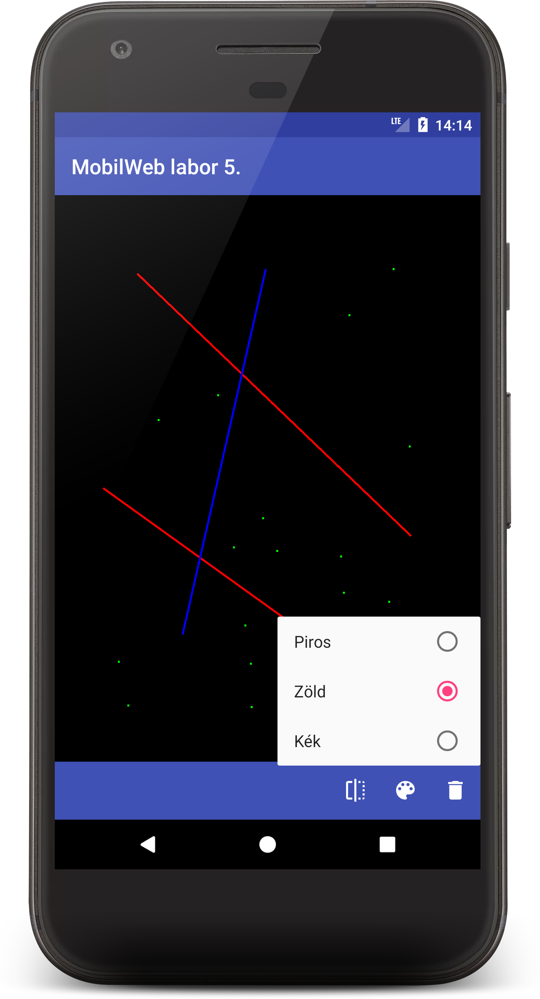
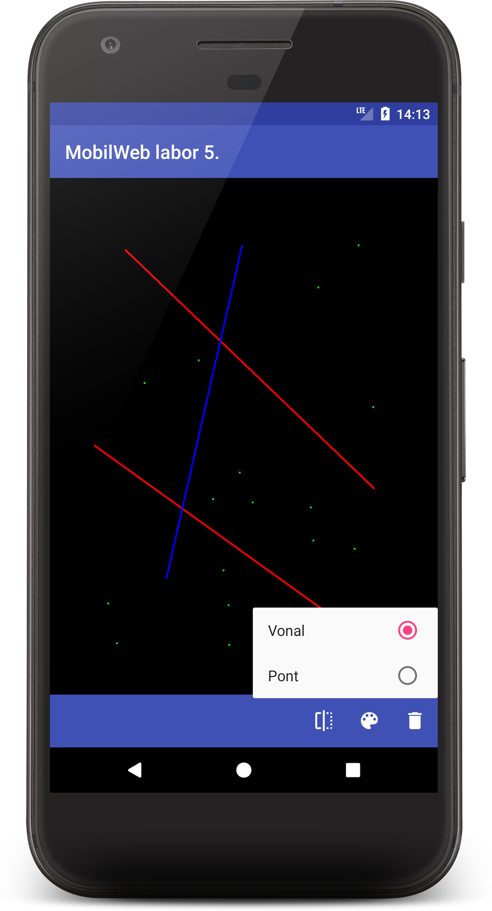

# Labor 05 - Rajzoló alkalmazás készítése

## Bevezető

A labor során egy egyszerű rajzoló alkalmazás elkészítése a feladat. Az alkalmazással egy vászonra lehet vonalakat vagy pontokat rajzolni. Ezen kívül szükséges a rajzolt ábrát perzisztensen elmenteni, hogy az alkalmazás újraindítása után is visszatöltődjön.

<p align="center">



</p>

## Feltöltés

Az elkészült megoldást `.zip` formátumban (File -> Export to zip file...) kell feltölteni a tárgy oldalán, ahol a laborvezető tudja értékelni.

## A projekt előkészítése

### A projekt létrehozása

Hozzunk létre egy új Android projektet, _Add no Activity_ opcióval. Az _Application name_ mezőben adjuk meg a `Simple Drawer` nevet. A _Package_ név legyen `hu.bme.aut.android.simpledrawer`. Nyelvnek a Kotlin legyen kiválasztva, a minimum SDK szintje legyen API 21. Ezután nyomjunk a **Finish** gombra.

Adjunk a projekthez egy új _Empty activity_ osztályt. _Activity name_-nek adjuk meg, hogy `DrawingActivity`, és hagyjuk bepipálva azt, hogy generáljon _layout_ fájlt, valamint pipáljuk be a _Launcher Activity_ opciót. Ha ezekkel megvagyunk, akkor rányomhatunk a **Finish**-re.

Miután létrejött a projekt, töröljük ki a teszt package-eket, mert most nem lesz rá szükségünk.

### A resource-ok hozzáadása

Először töltsük le [az alkalmazás képeit tartalmazó tömörített fájlt](./downloads/res.zip), ami tartalmazza az összes képet, amire szükségünk lesz. A tartalmát másoljuk be az `app/src/main/res` mappába (ehhez segít, ha _Android Studio_-ban bal fent a szokásos _Android_ nézetről a _Project_ nézetre váltunk erre az időre).

Az alábbi, alkalmazáshoz szükséges _string resource_-okat másoljuk be a `res/values/strings.xml` fájlba:

```xml
<resources>
   <string name="app_name">Simple Drawer</string>
   
   <string name="style">Stílus</string>
   <string name="line">Vonal</string>
   <string name="point">Pont</string>
   
   <string name="are_you_sure_want_to_exit">Biztosan ki akarsz lépni?</string>
   <string name="ok">OK</string>
   <string name="cancel">Mégse</string>
</resources>
```

### Álló layout kikényszerítése

Az alkalmazásunkban az egyszerűség kedvéért most csak az álló módot támogatjuk. Ehhez az `AndroidManifest.xml`-ben a `DrawingActivity` nyitótagjához kell hozzáadni egy sort a következő módon:

```xml
<activity
    android:name=".DrawingActivity"
    android:exported="true"
    android:screenOrientation="portrait">
```

## Laborfeladatok

A labor során a következő feladatokat kell megvalósítani a laborvezető segítségével, illetve bizonyos feladatokat önállóan. A labor végén lehetőség van **iMSc** pontokat is szerezni a jelölt feladatok megoldásával.

### 1. feladat: A kezdő layout létrehozása (1 pont)

Első lépésként hozzunk létre egy új _package_-et az `hu.bme.aut.android.simpledrawer`-en belül, aminek adjuk a `view` nevet. Ebben hozzunk létre egy új osztályt, amit nevezzünk el `DrawingView`-nak, és származzon le a `View` osztályból (`android.view.View`).

Hozzuk létre a szükséges konstruktort ezen belül:

```kotlin
class DrawingView(context: Context?, attrs: AttributeSet?) : View(context, attrs) {

}
```

Miután létrehoztuk a `DrawingView`-t, nyissuk meg a `res/layout/activity_drawing.xml`-t, és hozzunk létre gyökérelemként egy `RelativeLayout`-ot, azon belül pedig felülre a frissen létrehozott `DrawingView`-nkból helyezzünk el egy példányt fekete háttérrel, alulra pedig egy `Toolbar`-t rakjunk ki. Végezetül a layoutnak így kell kinéznie:

```xml
<?xml version="1.0" encoding="utf-8"?>
<RelativeLayout xmlns:android="http://schemas.android.com/apk/res/android"
	android:layout_width="match_parent"
	android:layout_height="match_parent">

	<hu.bme.aut.android.simpledrawer.view.DrawingView
		android:id="@+id/canvas"
		android:layout_width="match_parent"
		android:layout_height="wrap_content"
		android:layout_above="@+id/toolbar"
		android:background="@android:color/black" />

    <androidx.appcompat.widget.Toolbar
        android:id="@+id/toolbar"
        android:layout_width="match_parent"
        android:layout_height="wrap_content"
        android:layout_alignParentBottom="true"
        android:background="?android:colorPrimary" />
</RelativeLayout>
```

### 2. feladat: Stílusválasztó (2 pont)

Miután létrehoztuk a rajzolás tulajdonságainak állításáért felelős `Toolbar`-t, hozzuk létre a menüt, amivel be lehet állítani, hogy pontot vagy vonalat rajzoljunk. Ehhez hozzunk létre egy új _Android resource directory_-t `menu` néven a `res` mappában, és _Resource type_-nak is válasszuk azt, hogy `menu`. Ezen belül hozzunk létre egy új _Menu resource file_-t `menu_toolbar.xml` néven. Ebben hozzunk létre az alábbi hierarchiát:

```xml
<?xml version="1.0" encoding="utf-8"?>
<menu xmlns:android="http://schemas.android.com/apk/res/android"
    xmlns:app="http://schemas.android.com/apk/res-auto">
    <item
        android:id="@+id/menu_style"
        android:checkableBehavior="single"
        android:icon="@drawable/ic_style"
        android:title="@string/style"
        app:showAsAction="ifRoom">
        <menu>
            <group android:checkableBehavior="single">
                <item
                    android:id="@+id/menu_style_line"
                    android:checked="true"
                    android:title="@string/line" />
                <item
                    android:id="@+id/menu_style_point"
                    android:checked="false"
                    android:title="@string/point" />
            </group>
        </menu>
    </item>
</menu>
```

Ezután kössük be a menüt, hogy megjelenjen a `Toolbar`-on.
Ahhoz, hogy elérjük a létrehozott erőforrásokat kódból, view binding-ra lesz szükségünk. A modul szintű gradle file-ba fegyük fel a következő elemet. ***Ne felejtsünk*** el a `Sync` now gombra kattintani a módosítást követően.

```groovy
android {
    ...
    buildFeatures {
        viewBinding true
    }
}
```
Ezután hozzunk létre egy binding adattagot a `DrawingActivity`-n belül `toolbarBinding` néven és inicializáljuk az `onCreate` függvényben.

```kotlin
private lateinit var binding: ActivityDrawingBinding

override fun onCreate(savedInstanceState: Bundle?) {
    super.onCreate(savedInstanceState)
    binding = ActivityDrawingBinding.inflate(layoutInflater)
    setContentView(binding.root)
}
```

Már csak annyi van hátra, hogy a `DrawingActivity`-ben felüldefiniáljuk  az _Activity_ `onCreateOptionsMenu()` és `onOptionsItemSelected()` függvényét az alábbi módon:

```kotlin
override fun onCreateOptionsMenu(menu: Menu?): Boolean {
    val toolbarMenu: Menu = binding.toolbar.menu
    menuInflater.inflate(R.menu.menu_toolbar, toolbarMenu)
    for (i in 0 until toolbarMenu.size()) {
        val menuItem: MenuItem = toolbarMenu.getItem(i)
        menuItem.setOnMenuItemClickListener { item -> onOptionsItemSelected(item) }
        if (menuItem.hasSubMenu()) {
            val subMenu: SubMenu = menuItem.subMenu
            for (j in 0 until subMenu.size()) {
                subMenu.getItem(j)
                    .setOnMenuItemClickListener { item -> onOptionsItemSelected(item) }
            }
        }
    }
    return super.onCreateOptionsMenu(menu)
}
```
```kotlin
override fun onOptionsItemSelected(item: MenuItem): Boolean {
    return when (item.itemId) {
        R.id.menu_style_line -> {
            item.isChecked = true
            true
        }
        R.id.menu_style_point -> {
            item.isChecked = true
            true
        }
        else -> super.onOptionsItemSelected(item)
    }
}
```

### 3. feladat: A `DrawingView` osztály implementálása

#### A modellek létrehozása

A rajzprogramunk, ahogy az már az előző feladatban is kiderült, kétféle rajzolási stílust fog támogatni. Nevezetesen a pont- és vonalrajzolást. Ahhoz, hogy a rajzolt alakzatokat el tudjuk tárolni szükségünk lesz két új típusra, modellre, amihez hozzunk létre egy új _package_-et a `hu.bme.aut.android.simpledrawer`-en belül `model` néven.

Ezen belül először hozzunk létre egy `Point` osztályt, ami értelemszerűen a pontokat fogja reprezentálni. Kétparaméteres konstruktort fogunk  létrehozni, amihez alapértékeket rendelünk.

```kotlin
data class Point(
    var x: Float = 0F,
    var y: Float = 0F
)
```

Miután ezzel megvagyunk, hozzunk létre egy `Line` osztályt. Mivel egy vonalat a két végpontjának megadásával ki tudunk 
rajzoltatni, így elegendő két `Point`-ot tartalmaznia az osztálynak.

```kotlin
data class Line(
    var start: Point,
    var end: Point
)
```

#### A rajzolási stílus beállítása

Most, hogy megvannak a modelljeink el lehet kezdeni magának a rajzolás funkciójának fejlesztését. Ehhez a `DrawingView` osztályt fogjuk ténylegesen is elkészíteni. Először vegyünk fel az osztályon belül egy `companion object`-et, amiben a rajzolási stílus konstansait fogjuk meghatározni. Ehhez kapcsolódóan vegyünk fel egy új `field`-et az osztályunkba, amiben eltároljuk, hogy jelenleg milyen stílus van kiválasztva. 

```kotlin
companion object {
        const val DRAWING_STYLE_LINE = 1
        const val DRAWING_STYLE_POINT = 2
}

var currentDrawingStyle = DRAWING_STYLE_LINE
```

Ha ezek megvannak, akkor egészítsük ki a `DrawingActivity`-ben a menükezelést, úgy, hogy a megfelelő függvények hívódjanak meg. Az `onOptionsItemSelected()` függvény megfelelő `case` ágában meg kell hívnunk a `canvas`-ra a `setDrawingStyle()` függvényt a megfelelő paraméterrel.

```kotlin
override fun onOptionsItemSelected(item: MenuItem): Boolean {
    return when (item.itemId) {
        R.id.menu_style_line -> {
            binding.canvas.currentDrawingStyle = DrawingView.DRAWING_STYLE_LINE
            item.isChecked = true
            true
        }
        R.id.menu_style_point -> {
            binding.canvas.currentDrawingStyle = DrawingView.DRAWING_STYLE_POINT
            item.isChecked = true
            true
        }
        else -> super.onOptionsItemSelected(item)
    }
}
```
#### Inicializálások

A rajzolási funkció megvalósításához fel kell vennünk néhány további `field`-et a `DrawingView` osztályban, amiket a konstruktorban inicializálnunk kell. A paint objektumhoz hozzáadjuk a `lateinit` kulcsszót, hogy elég legyen az `init` blokkban inicializálnunk. A `Point` osztály import-ja során használjuk a korábban definiált osztályunkat.

```kotlin
private lateinit var paint: Paint

private var startPoint: Point? = null

private var endPoint: Point? = null

var lines: MutableList<Line> = mutableListOf()
var points: MutableList<Point> = mutableListOf()

init {
    initPaint()
}

private fun initPaint() {
    paint = Paint()
    paint.color = Color.GREEN
    paint.style = Paint.Style.STROKE
    paint.strokeWidth = 5F
}
```

#### Gesztusok kezelése

Ahhoz, hogy vonalat vagy pontot tudjunk rajzolni a `View`-nkra, kezelnünk kell a felhasználótól kapott gesztusokat, mint például amikor hozzáér a kijelzőhöz, elhúzza rajta vagy felemeli róla az ujját. Szerencsére ezeket a gesztusokat nem szükséges manuálisan felismernünk és lekezelnünk, a `View` ősosztály `onTouchEvent()` függvényének felüldefiniálásával egyszerűen megolható a feladat.

```kotlin
@SuppressLint("ClickableViewAccessibility")
override fun onTouchEvent(event: MotionEvent): Boolean {
    endPoint = Point(event.x, event.y)
    when (event.action) {
        MotionEvent.ACTION_DOWN -> startPoint = Point(event.x, event.y)
        MotionEvent.ACTION_MOVE -> {
        }
        MotionEvent.ACTION_UP -> {
            when (currentDrawingStyle) {
                DRAWING_STYLE_POINT -> addPointToTheList(endPoint!!)
                DRAWING_STYLE_LINE -> addLineToTheList(startPoint!!, endPoint!!)
            }
            startPoint = null
            endPoint = null
        }
        else -> return false
    }
    invalidate()
    return true
}

private fun addPointToTheList(startPoint: Point) {
    points.add(startPoint)
}

private fun addLineToTheList(startPoint: Point, endPoint: Point) {
    lines.add(Line(startPoint, endPoint))
}
```

Ahogy a fenti kódrészletből is látszik minden gesztusnál elmentjük az adott `TouchEvent` pontját, mint a rajzolás végpontját, illetve ha `MotionEvent.ACTION_DOWN` történt, tehát a felhasználó hozzáért a `View`-hoz, elmentjük ezt kezdőpontként is. Amíg a felhasználó mozgatja az ujját a `View`-n (`MotionEvent.ACTION_MOVE`), addig nem csinálunk semmit, de amint felemeli (`MotionEvent.ACTION_UP`), elmentjük az adott elemet a korábban már definiált listákba. Ezen kívül minden egyes alkalommal meghívjuk az `invalidate()` függvényt, ami kikényszeríti a `View` újrarajzolását.

#### A rajzolás

A rajzolás megvalósításához a `View` ősosztály `onDraw()` metódusát kell felüldefiniálnunk. Egyrészt ki kell rajzolnunk a már meglévő objektumokat (amiket a `MotionEvent.ACTION_UP` eseménynél beleraktunk a listába), valamint ki kell rajzolnunk az aktuális kezdőpont (a `MotionEvent.ACTION_DOWN` eseménytől) és a felhasználó ujja közötti vonalat.

```kotlin
override fun onDraw(canvas: Canvas) {
    super.onDraw(canvas)
    for (point in points) {
        drawPoint(canvas, point)
    }
    for (line in lines) {
        drawLine(canvas, line.start, line.end)
    }
    when (currentDrawingStyle) {
        DRAWING_STYLE_POINT -> drawPoint(canvas, endPoint)
        DRAWING_STYLE_LINE -> drawLine(canvas, startPoint, endPoint)
    }
}

private fun drawPoint(canvas: Canvas, point: Point?) {
    if (point == null) {
        return
    }
    canvas.drawPoint(point.x, point.y, paint)
}

private fun drawLine(canvas: Canvas, startPoint: Point?, endPoint: Point?) {
    if (startPoint == null || endPoint == null) {
        return
    }
    canvas.drawLine(
        startPoint.x,
        startPoint.y,
        endPoint.x,
        endPoint.y,
        paint
    )
}
```

### 4. feladat: Perzisztencia megvalósítása _SQLite_ adatbázis segítségével (1 pont)

Ahhoz, hogy az általunk rajzolt objektumok megmaradjanak az alkalmazásból való kilépés után is, az adatainkat valahogy olyan formába kell rendeznünk, hogy azt könnyedén el tudjuk tárolni egy _SQLite_ adatbázisban. 

Hozzunk létre egy új _package_-et az `hu.bme.aut.android.simpledrawer`-en belül, aminek adjuk az `sqlite` nevet.

#### Táblák definiálása

Az adatbáziskezelés során sok konstans jellegű változóval kell dolgoznunk, mint például a táblákban lévő oszlopok nevei, táblák neve, adatbázis fájl neve, séma létrehozó és törlő szkiptek, stb. Ezeket érdemes egy közös helyen tárolni, így szerkesztéskor vagy új entitás bevezetésekor nem kell a forrásfájlok között ugrálni, valamint egyszerűbb a teljes adatbázist létrehozó és törlő szkripteket generálni. Hozzunk létre egy új _singleton_ osztályt az `object` kulcsszóval az `sqlite` _package_-en belül `DbConstants` néven. 

Ezen belül először is konstansként felvesszük az adatbázis nevét és verzióját is. Ha az adatbázisunk sémáján szeretnénk változtatni, akkor ez utóbbit kell inkrementálnunk, így elkerülhetjük az inkompatibilitás miatti nem kívánatos hibákat.

```kotlin
object DbConstants {

    const val DATABASE_NAME = "simpledrawer.db"
    const val DATABASE_VERSION = 1
}
```

Ezek után a `DbConstants` nevű osztályba hozzuk létre a `Point` osztályhoz a konstansokat. Az osztályokon belül létrehozunk egy `enum`-ot is, hogy könnyebben tudjuk kezelni a tábla oszlopait, majd konstansokban eltároljuk a tábla létrehozását szolgáló _SQL utasítást_ valamint a tábla nevét is. Végezetül elkészítjük azokat a függvényeket, amelyeket a tábla létrehozásakor, illetve upgrade-elésekor kell meghívni:

```kotlin
object DbConstants {

    const val DATABASE_NAME = "simpledrawer.db"
    const val DATABASE_VERSION = 1

    object Points {
        const val DATABASE_TABLE = "points"

        enum class Columns {
            ID, COORD_X, COORD_Y
        }

        private val DATABASE_CREATE = """create table if not exists $DATABASE_TABLE (
            ${Columns.ID.name} integer primary key autoincrement,
            ${Columns.COORD_X.name} real not null,
            ${Columns.COORD_Y} real not null
            );"""

        private const val DATABASE_DROP = "drop table if exists $DATABASE_TABLE;"

        fun onCreate(database: SQLiteDatabase) {
            database.execSQL(DATABASE_CREATE)
        }

        fun onUpgrade(database: SQLiteDatabase, oldVersion: Int, newVersion: Int) {
            Log.w(
                Points::class.java.name,
                "Upgrading from version $oldVersion to $newVersion"
            )
            database.execSQL(DATABASE_DROP)
            onCreate(database)
        }
    }
}
```

Figyeljük meg, hogy a `DbConstants` osztályon belül létrehoztunk egy belső `Points` nevű osztályt, amiben a `Points` entitásokat tároló táblához tartozó konstans értékeket tároljuk. Amennyiben az alkalmazásunk több entitást is adatbázisban tárol, akkor érdemes az egyes osztályokhoz tartozó konstansokat külön-külön belső osztályokban tárolni. Így sokkal átláthatóbb és karbantarthatóbb lesz a kód, mint ha ömlesztve felvennénk a DbConstants-ba az összes tábla összes konstansát. Ezek a belső osztályok praktikusan ugyanolyan névvel léteznek, mint az entitás osztályok. Vegyük tehát fel hasonló módon a `Lines` nevű osztályt is:

```kotlin
object Lines {
    const val DATABASE_TABLE = "lines"

    enum class Columns {
        ID, START_X, START_Y, END_X, END_Y
    }

    private val DATABASE_CREATE ="""create table if not exists $DATABASE_TABLE (
    ${Columns.ID.name} integer primary key autoincrement,
    ${Columns.START_X} real not null,
    ${Columns.START_Y} real not null,
    ${Columns.END_X} real not null,
    ${Columns.END_Y} real not null

    );"""

    private const val DATABASE_DROP = "drop table if exists $DATABASE_TABLE;"

    fun onCreate(database: SQLiteDatabase) {
        database.execSQL(DATABASE_CREATE)
    }

    fun onUpgrade(database: SQLiteDatabase, oldVersion: Int, newVersion: Int) {
        Log.w(
            Lines::class.java.name,
            "Upgrading from version $oldVersion to $newVersion"
        )
        database.execSQL(DATABASE_DROP)
        onCreate(database)
    }
}
```

Érdemes megfigyelni továbbá azt is, hogy az osztályokat nem a class kulcsszóval deklaráltuk. Helyette az `object`-et használjuk, amivel a Kotlin nyelv azt biztosítja számunkra, hogy a `DbConstants` és a benne lévő `Points` és `Lines` osztály is singletonként viselkednek, azaz az alkalmazás futtatásakor létrejön belőlük egy példány, további példányokat pedig nem lehet létrehozni belőlük.


#### A segédosztályok létrehozása

Az adatbázis létrehozásához szükség van egy olyan segédosztályra, ami létrehozza magát az adatbázist, és azon belül inicializálja a táblákat is. Esetünkben ez lesz a `DBHelper` osztály, ami az `SQLiteOpenHelper` osztályból származik. Vegyük fel ezt is az `sqlite` _package_-be.


```kotlin
class DbHelper(context: Context) :
    SQLiteOpenHelper(context, DbConstants.DATABASE_NAME, null, DbConstants.DATABASE_VERSION) {

    override fun onCreate(sqLiteDatabase: SQLiteDatabase) {
        DbConstants.Lines.onCreate(sqLiteDatabase)
        DbConstants.Points.onCreate(sqLiteDatabase)
    }

    override fun onUpgrade(
        sqLiteDatabase: SQLiteDatabase,
        oldVersion: Int,
        newVersion: Int
    ) {
        DbConstants.Lines.onUpgrade(sqLiteDatabase, oldVersion, newVersion)
        DbConstants.Points.onUpgrade(sqLiteDatabase, oldVersion, newVersion)
    }
}
```

Ezen kívül szükségünk van még egy olyan segédosztályra is, ami ezt az egészet összefogja, és amivel egyszerűen tudjuk kezelni az adatbázisunkat. Ez lesz a `PersistentDataHelper` továbbra is az `sqlite` _package_-ben. Ebben olyan függényeket fogunk megvalósítani, mint pl. az `open()` és a `close()`, amikkel az adatbáziskapcsolatot nyithatjuk meg, illetve zárhatjuk le. Ezen kívül ebben az osztályban valósítjuk meg azokat a függvényeket is, amik az adatok adatbázisba való kiírásáért, illetve az onnan való kiolvasásáért felelősek. Figyeljünk rá, hogy a saját Point osztályunkat válasszuk az _import_ során.

```kotlin
class PersistentDataHelper(context: Context) {
    private var database: SQLiteDatabase? = null
    private val dbHelper: DbHelper = DbHelper(context)

    private val pointColumns = arrayOf(
        DbConstants.Points.Columns.ID.name,
        DbConstants.Points.Columns.COORD_X.name,
        DbConstants.Points.Columns.COORD_Y.name
    )

    private val lineColumns = arrayOf(
        DbConstants.Lines.Columns.ID.name,
        DbConstants.Lines.Columns.START_X.name,
        DbConstants.Lines.Columns.START_Y.name,
        DbConstants.Lines.Columns.END_X.name,
        DbConstants.Lines.Columns.END_Y.name

    )

    @Throws(SQLiteException::class)
    fun open() {
        database = dbHelper.writableDatabase
    }

    fun close() {
        dbHelper.close()
    }

    fun persistPoints(points: List<Point>) {
        clearPoints()
        for (point in points) {
            val values = ContentValues()
            values.put(DbConstants.Points.Columns.COORD_X.name, point.x)
            values.put(DbConstants.Points.Columns.COORD_Y.name, point.y)
            database!!.insert(DbConstants.Points.DATABASE_TABLE, null, values)
        }
    }

    fun restorePoints(): MutableList<Point> {
        val points: MutableList<Point> = ArrayList()
        val cursor: Cursor =
            database!!.query(DbConstants.Points.DATABASE_TABLE, pointColumns, null, null, null, null, null)
        cursor.moveToFirst()
        while (!cursor.isAfterLast) {
            val point: Point = cursorToPoint(cursor)
            points.add(point)
            cursor.moveToNext()
        }
        cursor.close()
        return points
    }

    fun clearPoints() {
        database!!.delete(DbConstants.Points.DATABASE_TABLE, null, null)
    }

    private fun cursorToPoint(cursor: Cursor): Point {
        val point = Point()
        point.x =cursor.getFloat(DbConstants.Points.Columns.COORD_X.ordinal)
        point.y =cursor.getFloat(DbConstants.Points.Columns.COORD_Y.ordinal)
        return point
    }

    fun persistLines(lines: List<Line>) {
        clearLines()
        for (line in lines) {
            val values = ContentValues()
            values.put(DbConstants.Lines.Columns.START_X.name, line.start.x)
            values.put(DbConstants.Lines.Columns.START_Y.name, line.start.y)
            values.put(DbConstants.Lines.Columns.END_X.name, line.end.x)
            values.put(DbConstants.Lines.Columns.END_Y.name, line.end.y)
            database!!.insert(DbConstants.Lines.DATABASE_TABLE, null, values)
        }
    }

    fun restoreLines(): MutableList<Line> {
        val lines: MutableList<Line> = ArrayList()
        val cursor: Cursor =
            database!!.query(DbConstants.Lines.DATABASE_TABLE, lineColumns, null, null, null, null, null)
        cursor.moveToFirst()
        while (!cursor.isAfterLast) {
            val line: Line = cursorToLine(cursor)
            lines.add(line)
            cursor.moveToNext()
        }
        cursor.close()
        return lines
    }

    fun clearLines() {
        database!!.delete(DbConstants.Lines.DATABASE_TABLE, null, null)
    }

    private fun cursorToLine(cursor: Cursor): Line {
        val startPoint = Point(
            cursor.getFloat(DbConstants.Lines.Columns.START_X.ordinal),
            cursor.getFloat(DbConstants.Lines.Columns.START_Y.ordinal)
        )
        val endPoint = Point(
            cursor.getFloat(DbConstants.Lines.Columns.END_X.ordinal),
            cursor.getFloat(DbConstants.Lines.Columns.END_Y.ordinal)
        )
        return Line(startPoint, endPoint)
    }

}
```

#### A `DrawingView` kiegészítése

Ahhoz, hogy a rajzolt objektumainkat el tudjuk menteni az adatbázisba, fel kell készíteni a `DrawingView` osztályunkat arra, hogy átadja, illetve meg lehessen adni neki kívülről is őket. Ehhez a következő függvényeket kell felvennünk:

```kotlin
fun restoreObjects(points: MutableList<Point>?, lines: MutableList<Line>?) {
    points?.also { this.points = it }
    lines?.also { this.lines = it }
    invalidate()
}
```

#### A `DrawingActivity` kiegészítése

A perzisztencia megvalósításához már csak egy feladatunk maradt hátra, mégpedig az, hogy bekössük a frissen létrehozott osztályainkat az `DrawerActivity`-nkbe. Ehhez először is példányosítanunk kell a `PersistentDataHelper` osztályunkat. Mivel az adatbázishozzáférés drága erőforrás, ezért ne felejtsük el az `Activity` `onResume()` függvényében megnyitni, az `onPause()` függvényében pedig lezárni a vele való kapcsolatot:

```kotlin
private lateinit var dataHelper: PersistentDataHelper

override fun onCreate(savedInstanceState: Bundle?) {
    super.onCreate(savedInstanceState)
    binding = ActivityDrawingBinding.inflate(layoutInflater)
    setContentView(binding.root)

    dataHelper = PersistentDataHelper(this)
    dataHelper.open()
    restorePersistedObjects()
}

override fun onResume() {
    super.onResume()
    dataHelper.open()
}

override fun onPause() {
    dataHelper.close()
    super.onPause()
}

private fun restorePersistedObjects() {
    binding.canvas.restoreObjects(dataHelper.restorePoints(), dataHelper.restoreLines())
}
```

Végezetül szeretnénk, hogy amikor a felhasználó ki szeretne lépni az alkalmazásból, akkor egy dialógusablak jelenjen meg, hogy biztos kilép-e, és ha igen, csak abban az esetben mentsük el a rajzolt objektumokat, és lépjünk ki az alkalmazásból. Ehhez felül kell definiálnunk az `Activity` `onBackPressed()` függvényét. Az _AlertDialog_-nál válasszuk az _anroidx.appcompat.app_-ba tartozó verziót.

```kotlin
override fun onBackPressed() {
    AlertDialog.Builder(this)
        .setMessage(R.string.are_you_sure_want_to_exit)
        .setPositiveButton(R.string.ok) { _, _ -> onExit() }
        .setNegativeButton(R.string.cancel, null)
        .show()
}

private fun onExit() {
    dataHelper.persistPoints(binding.canvas.points)
    dataHelper.persistLines(binding.canvas.lines)
    dataHelper.close()
    finish()
}
```

### 5. (önálló) feladat: A vászon törlése (1 pont)

Vegyünk fel a vezérlők közé egy olyan gombot, amelynek segíségével a törölhetjük a vásznat, valósítsuk is meg a funkciót!

## Kiegészítő iMSc feladat (2 iMSc pont)

Vegyünk fel az alkalmazásba egy olyan vezérlőt, amivel változtatni lehet a rajzolás színét a 3 fő szín között (_RGB_).

**Figyelem:** az adatbázisban is el kell menteni az adott objektum színét!