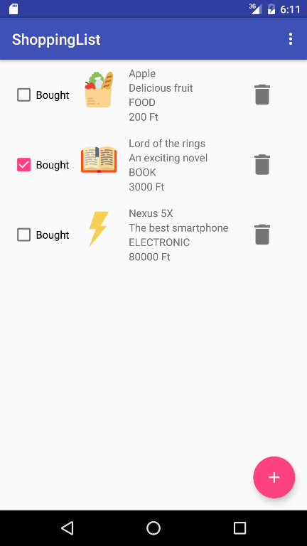
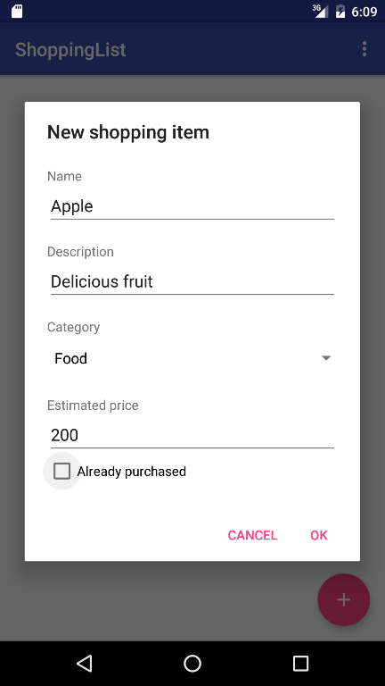

# Labor 06 - Bevásárló alkalmazás készítése

## Bevezető
A labor során egy bevásárló lista alkalmazás elkészítése a feladat. Az alkalmazásban fel lehet venni megvásárolni kívánt termékeket, valamint  megvásároltnak lehet jelölni és törölni lehet meglévőket.

Az alkalmazás a termékek listáját [`RecyclerView`](https://developer.android.com/guide/topics/ui/layout/recyclerview)-ban jeleníti meg, a lista elemeket és azok állapotát a [`Room`](https://developer.android.com/topic/libraries/architecture/room) nevű ORM library segítségével tárolja perzisztensen. Új elem felvételére egy [`FloatingActionButton`](https://developer.android.com/guide/topics/ui/floating-action-button) megnyomásával van lehetőség.

> ORM = [Object-relational mapping](https://en.wikipedia.org/wiki/Object-relational_mapping)

<p align="center">


</p>

Felhasznált technológiák:
- [`Activity`](https://developer.android.com/guide/components/activities/intro-activities)
- [`Fragment`](https://developer.android.com/guide/components/fragments)
- [`RecyclerView`](https://developer.android.com/guide/topics/ui/layout/recyclerview)
- [`FloatingActionButton`](https://developer.android.com/guide/topics/ui/floating-action-button) 
- [`Room`](https://developer.android.com/topic/libraries/architecture/room)

## Feltöltés
Az elkészült megoldást `.zip` formátumban (teljes Android Studio projekt – build mappa kivehető) kell feltölteni a tárgy oldalán, ahol a laborvezető tudja értékelni.

## Az alkalmazás specifikációja
Az alkalmazás egy `Activity`-ből áll, ami bevásárlólista elemeket jelenít meg. Új elemet a jobb alsó sarokban található `FloatingActionButton` segítségével vehetünk fel. Erre kattintva egy dialógus jelenik meg, amin megadhatjuk a vásárolni kívánt áru nevét, leírását, kategóriáját és becsült árát.
A dialóguson az *OK* gombra kattintva a dialógus eltűnik, a benne megadott adatokkal létrejön egy lista elem a listában. Az egyes lista elemeken `CheckBox` segítségével jelezhetjük, hogy már megvásároltuk őket. A kuka ikonra kattintva törölhetjük az adott elemet.
A menüben található „Remove all” opcióval az összes lista elemet törölhetjük.

## Laborfeladatok
A labor során az alábbi feladatokat a laborvezető segítségével, illetve a jelölt feladatokat önállóan kell megvalósítani.

1. Perzisztens adattárolás megvalósítása: 1 pont
2. Lista megjelenítése`RecyclerView`-val: 2 pont
3. Dialógus megvalósítása új elem hozzáadásához: 1pont
4. **Önálló feladat** (törlés megvalósítása): 1 pont

### IMSc pontok

A laborfeladatok sikeres befejezése után az IMSc feladatokat megoldva 2 IMSc pont szerezhető:

* Megerősítő dialógus: 1 pont

* Elemek szerkesztése: 1 pont

### Projekt létrehozása
Hozzunk létre egy új projektet Android Studioban! Első `Activity`-ként válasszuk a *Basic Activity* lehetőséget, a projekt neve legyen `ShoppingList`, a *Package name* `hu.bme.aut.shoppinglist`, minimum SDK-nak pedig válasszuk az **API 21**-et és kattintsunk a *Finish* gombra!
Töltsük le és tömörítsük ki [az alkalmazáshoz szükséges erőforrásokat](https://github.com/VIAUAC00/Android-labor-kotlin/tree/master/Labor06/downloads/res.zip), majd másoljuk be őket a projekt *app/src/main/res* mappájába (Studio-ban a *res* mappán állva *Ctrl+V*)!
Töröljük a FirstFragment, SecondFragment osztályokat, a hozzájuk tartozó layoutokat, illetve a `res` mappában a `navigation` könyvtárat.

### Perzisztens adattárolás megvalósítása (1 pont)
Az adatok perzisztens tárolásához a `Room` könyvtárat fogjuk használni.

#### Room hozzáadása a projekthez
Az *app* modulhoz tartozó `build.gradle` fájlban a `dependencies` blokkhoz adjuk hozzá a `Room` libraryt:
```gradle
apply plugin: 'com.android.application'
apply plugin: 'kotlin-android'
apply plugin: 'kotlin-android-extensions'
apply plugin: 'kotlin-kapt'
//...

dependencies {
    //...
    def room_version = "2.2.5"
    implementation "androidx.room:room-runtime:$room_version"
    kapt "androidx.room:room-compiler:$room_version"
}
```
Ezután kattintsunk a jobb felső sarokban megjelenő **Sync now** gombra.

A  `Room` egy kényelmes adatbazáskezelést lehetővé tevő API-t nyújt a platform szintű SQLite implementáció fölé. Megspórolható vele a korábban látott sok újra és újra megírandó kód, például a táblák adatait és létrehozó scriptjét tartalmazó *Table osztályok, a DBHelper és a PersistentDataHelper*. Ezeket és más segédosztályokat a `Room` *annotation* alapú kódgenerálással hozza létre a *build* folyamat részeként.

A `Room` alapvető komponenseinek, architektúrájának és használatának leírása megtalálható a megfelelő [developer.android.com](https://developer.android.com/training/data-storage/room/) oldalon.

#### Egy modell osztály létrehozása
A `hu.bme.aut.shoppinglist` package-ben hozzunk létre egy új package-et `data` néven. A `data` package-ben hozzunk létre egy új Kotlin osztályt, aminek a neve legyen  `ShoppingItem`:
```kotlin
@Entity(tableName = "shoppingitem")
data class ShoppingItem(
    @ColumnInfo(name = "id") @PrimaryKey(autoGenerate = true) val id: Long?,
    @ColumnInfo(name = "name") val name: String,
    @ColumnInfo(name = "description") val description: String,
    @ColumnInfo(name = "category") val category: Category,
    @ColumnInfo(name = "estimated_price") val estimatedPrice: Int,
    @ColumnInfo(name = "is_bought") val isBought: Boolean
) {
    enum class Category {
        FOOD, ELECTRONIC, BOOK;
        companion object {
            @JvmStatic
            @TypeConverter
            fun getByOrdinal(ordinal: Int): Category? {
                var ret: Category? = null
                for (cat in values()) {
                    if (cat.ordinal == ordinal) {
                        ret = cat
                        break
                    }
                }
                return ret
            }
            
            @JvmStatic
            @TypeConverter
            fun toInt(category: Category): Int {
                return category.ordinal
            }
        }
    }
}
```
Látható, hogy az osztályon, az osztály változóin, valamint az osztályon belül lévő *enum* osztály függvényein *annotációkat* helyeztünk el. Az `@Entity` jelzi a `Room` kódgenerátorának, hogy ennek az osztálynak a példányai adatbázis rekordoknak fognak megfelelni egy táblában és hogy az egyes változói felelnek majd meg a tábla oszlopainak. A `@ColumnInfo` *annotációval* megadjuk, hogy mi legyen a tagváltozónak megfelelő oszlop neve. `@PrimaryKey`-jel jelöljük a tábla egyszerű kulcs attribútumát. A `@TypeConverter` annotációval megoldható az, hogy összetett objektumokat is tudjunk menteni és visszaolvasni.

#### Egy DAO osztály létrehozása

> DAO = [Data Access Object](https://en.wikipedia.org/wiki/Data_access_object)

A `data` package-ben hozzunk létre egy új Kotlin interfészt, aminek a neve legyen  `ShoppingItemDao`:

```kotlin
@Dao
interface ShoppingItemDao {
    @Query("SELECT * FROM shoppingitem")
    fun getAll(): List<ShoppingItem>

    @Insert
    fun insert(shoppingItems: ShoppingItem): Long

    @Update
    fun update(shoppingItem: ShoppingItem)

    @Delete
    fun deleteItem(shoppingItem: ShoppingItem)
}
```

Egy `@Dao` *annotációval* ellátott interfész a `Room` kódgenerátora számára azt jelzi, hogy generálni kell az interfészhez egy olyan implementációt, ami az interfész függvényeket az azokon lévő annotációk (`@Query`, `@Insert`, `@Update`, `@Delete`) alapján valósítja meg.

Figyeljük meg, hogy az Android Studio a `@Query` *annotáció* paramétereként átadott SQLite scriptre is nyújt kódkiegészítést, hiba jelzést!

#### Az adatbázis osztály létrehozása

A `data` package-ben hozzunk létre egy új Kotlin osztályt, aminek a neve legyen  `ShoppingListDatabase`:

```kotlin
@Database(entities = [ShoppingItem::class], version = 1)
@TypeConverters(value = [ShoppingItem.Category::class])
abstract class ShoppingListDatabase : RoomDatabase() {
    abstract fun shoppingItemDao(): ShoppingItemDao
}
```

A `@Database` *annotációval* lehet jelezni a kódgenerátornak, hogy egy osztály egy adatbázist fog reprezentálni. Az ilyen osztálynak *absztraktnak* kell lennie, valamint a `RoomDatabase`-ből kell származnia. Az *annotáció* `entities` paraméterének egy listát kell átadni, ami az adatbázis tábláknak megfelelő `@Entity`-vel jelzett osztályokat tartalmazza. A `version` paraméter értéke a korábban is látott lokális adatbázis verzió. A `@TypeConverters` *annotációval* lehet megadni a `Room`-nak olyan osztályokat, amik `@TypeConverter`-rel ellátott függvényeket tartalmaznak, ezzel támogatva a típuskonverziót adatbázis és objektum modell között. A `ShoppingListDatabase` osztály felelős a megfelelő DAO osztályok elérhetőségéért is.

### Lista megjelenítése`RecyclerView`-val (2 pont)

#### A lista adapter létrehozása
Következő lépésként a lista adaptert fogjuk létrehozni, ami a modell elemeket fogja majd szolgáltatni a `RecyclerView`-nak.

A `hu.bme.aut.shoppinglist` package-ben hozzunk létre egy új package-et `adapter` néven!

Az `adapter` package-ben hozzunk létre egy új Kotlin osztályt `ShoppingAdapter` néven:

```kotlin
class ShoppingAdapter(private val listener: ShoppingItemClickListener) :
    RecyclerView.Adapter<ShoppingAdapter.ShoppingViewHolder>() {

    private val items = mutableListOf<ShoppingItem>()
    override fun onCreateViewHolder(parent: ViewGroup, viewType: Int): ShoppingViewHolder {
        val itemView: View = LayoutInflater
            .from(parent.context)
            .inflate(R.layout.item_shopping_list, parent, false)
        return ShoppingViewHolder(itemView)
    }

    override fun onBindViewHolder(holder: ShoppingViewHolder, position: Int) {
        // TODO implementation
    }

    override fun getItemCount(): Int {
        return items.size
    }

    interface ShoppingItemClickListener {
        fun onItemChanged(item: ShoppingItem)
    }

    inner class ShoppingViewHolder(itemView: View) : RecyclerView.ViewHolder(itemView){
        // TODO implementation
    }
}
```

 A listát `RecyclerView` segítségével szeretnénk megjeleníteni, ezért az adapter a `RecyclerView.Adapter` osztályból származik. Az adapter a modell elemeket egy listában tárolja. A rendszer a `RecyclerView`-val való hatékony lista megjelenítéshez a [*ViewHolder* tervezési mintát](https://developer.android.com/training/improving-layouts/smooth-scrolling#java) valósítja meg, ezért szükség van egy `ViewHolder` osztály megadására is. `ViewHolder`-eken keresztül érhetjük majd el a lista elemekhez tartozó `View`-kat. Mivel a `ViewHolder` osztály példányai az Adapterhez lesznek csatolva (azért, hogy elérjék a belső változóit), `inner class` osztályként kell definiálni.

A `RecyclerView.Adapter` három absztrakt függvényt definiál, amelyeket kötelező megvalósítani. Az `onCreateViewHolder()`-ben hozzuk létre az adott lista elemet megjelenítő `View`-t és a hozzá tartozó `ViewHolder`-t. Az `onBindViewHolder()`-ben kötjük hozzá a modell elemhez a nézetet, a `getItemCount()` pedig a listában található (általános esetre fogalmazva a megjelenítendő) elemek számát kell, hogy visszaadja.

A `ShoppingAdapter`-ben definiáltunk egy `ShoppingItemClickListener` nevű interfészt is, aminek a segítségével jelezhetjük az alkalmazás többi része felé, hogy esemény történt egy lista elemen.

Az `R.layout.item_shopping_list` azonosítóra hibát jelez a fordító, hiszen még nem hoztuk létre a hivatkozott layout erőforrást. Kattintsunk rá, majd nyomjuk meg az *Alt + Enter* billentyű kombinációt. Válasszuk az első lehetőséget: *„Create layout resource file item_shopping_list.xml”*. Cseréljük le az újonnan létrehozott fájl tartalmát az alábbira:
```xml
<?xml version="1.0" encoding="utf-8"?>
<LinearLayout xmlns:android="http://schemas.android.com/apk/res/android"
    xmlns:tools="http://schemas.android.com/tools"
    android:layout_width="match_parent"
    android:layout_height="wrap_content"
    android:orientation="horizontal"
    android:paddingBottom="8dp"
    android:paddingLeft="16dp"
    android:paddingRight="16dp"
    android:paddingTop="8dp">

    <CheckBox
        android:id="@+id/ShoppingItemIsBoughtCheckBox"
        android:layout_width="wrap_content"
        android:layout_height="wrap_content"
        android:layout_gravity="center_vertical"
        android:text="@string/bought" />

    <ImageView
        android:id="@+id/ShoppingItemIconImageView"
        android:layout_width="64dp"
        android:layout_height="64dp"
        android:layout_marginLeft="8dp"
        android:padding="8dp"
        tools:src="@drawable/open_book" />

    <LinearLayout
        android:layout_width="0dp"
        android:layout_height="wrap_content"
        android:layout_marginLeft="8dp"
        android:layout_weight="1"
        android:orientation="vertical">

        <TextView
            android:id="@+id/ShoppingItemNameTextView"
            android:layout_width="wrap_content"
            android:layout_height="wrap_content"
            tools:text="Apple" />

        <TextView
            android:id="@+id/ShoppingItemDescriptionTextView"
            android:layout_width="wrap_content"
            android:layout_height="wrap_content"
            tools:text="My favorite fruit" />

        <TextView
            android:id="@+id/ShoppingItemCategoryTextView"
            android:layout_width="wrap_content"
            android:layout_height="wrap_content"
            tools:text="Food" />

        <TextView
            android:id="@+id/ShoppingItemPriceTextView"
            android:layout_width="wrap_content"
            android:layout_height="wrap_content"
            tools:text="20 Ft" />
    </LinearLayout>

    <ImageButton
        android:id="@+id/ShoppingItemRemoveButton"
        style="@style/Widget.AppCompat.Button.Borderless"
        android:layout_width="50dp"
        android:layout_height="50dp"
        android:layout_gravity="center_vertical"
        android:scaleType="fitXY"
        android:src="@drawable/ic_delete_grey600_48dp" />

</LinearLayout>
```
Hozzuk létre a `@string/bought` erőforrást! Kattintsunk rá az erőforrás hivatkozásra, majd *Alt + Enter* lenyomása után válasszuk a *„Create string value resource ’bought’”* lehetőséget! A felugró ablakban az erőforrás értékének adjuk a "Bought" értéket (idézőjelek nélkül)!

Térjünk vissza az `ShoppingAdapter`-hez, és adjuk hozzá a `ShoppingViewHolder`-hez a megfelelő mezőket. Ezeken a mezőkön keresztül fogjuk tudni elérni az egyes lista elemekhez tartozó nézeteket.

```kotlin
inner class ShoppingViewHolder(itemView: View) : RecyclerView.ViewHolder(itemView){
	val iconImageView: ImageView
	val nameTextView: TextView
	val descriptionTextView: TextView
	val categoryTextView: TextView
	val priceTextView: TextView
	val isBoughtCheckBox: CheckBox
	val removeButton: ImageButton
	
	var item: ShoppingItem? = null

	init {
		iconImageView = itemView.findViewById(R.id.ShoppingItemIconImageView)
		nameTextView = itemView.findViewById(R.id.ShoppingItemNameTextView)
		descriptionTextView = itemView.findViewById(R.id.ShoppingItemDescriptionTextView)
		categoryTextView = itemView.findViewById(R.id.ShoppingItemCategoryTextView)
		priceTextView = itemView.findViewById(R.id.ShoppingItemPriceTextView)
		isBoughtCheckBox = itemView.findViewById(R.id.ShoppingItemIsBoughtCheckBox)
		removeButton = itemView.findViewById(R.id.ShoppingItemRemoveButton)
		isBoughtCheckBox.setOnCheckedChangeListener(CompoundButton.OnCheckedChangeListener { buttonView, isChecked ->
			item?.let { 
				val newItem = it.copy(
					isBought = isChecked
				)
				item = newItem
				listener.onItemChanged(newItem)
			}
		})
	}
}
```
Figyeljük meg, hogy az `isBoughtCheckBox`-ra egyszer, a `ViewHolder` létrehozásakor állítunk `OnCheckedChangeListener`-t, és csak a callbackben visszaadott `item` fog változni!

Valósítsuk meg a `ShoppingAdapter` osztály `onBindViewHolder()`függvényét, azaz kössük hozzá a megfelelő modell elem tulajdonságait lista elem nézeteihez:

```kotlin
override fun onBindViewHolder(holder: ShoppingViewHolder, position: Int) {
	val item = items[position]
	holder.nameTextView.text = item.name
	holder.descriptionTextView.text = item.description
	holder.categoryTextView.text = item.category.name
	holder.priceTextView.text = item.estimatedPrice.toString() + " Ft"
	holder.iconImageView.setImageResource(getImageResource(item.category))
	holder.isBoughtCheckBox.isChecked = item.isBought

	holder.item = item
}
```
Adjuk hozzá a `ShoppingAdapter` osztályhoz az eddig hiányzó `getImageResource()` függvényt:

```kotlin
@DrawableRes
private fun getImageResource(category: ShoppingItem.Category) = when (category) {
	ShoppingItem.Category.BOOK -> R.drawable.open_book
	ShoppingItem.Category.ELECTRONIC -> R.drawable.lightning
	ShoppingItem.Category.FOOD -> R.drawable.groceries
}
```
Biztosítsuk egy elem hozzáadásának, valamint a teljes lista frissítésének lehetőségét az alábbi függvényekkel:

```kotlin
fun addItem(item: ShoppingItem) {
	items.add(item)
	notifyItemInserted(items.size - 1)
}

fun update(shoppingItems: List<ShoppingItem>) {
	items.clear()
	items.addAll(shoppingItems)
	notifyDataSetChanged()
}
```

#### A `RecyclerView` és az adatok megjelenítése

Szeretnék, hogy a bevásárlólista alkalmazás egyetlen `Activity`-jét teljesen elfoglalja. Ennek az eléréséhez cseréljük le a `content_main.xml` tartalmát úgy, hogy a nézet egyetlen `RecyclerViev`-ból álljon:

```xml
<?xml version="1.0" encoding="utf-8"?>
<androidx.recyclerview.widget.RecyclerView xmlns:android="http://schemas.android.com/apk/res/android"
    xmlns:app="http://schemas.android.com/apk/res-auto"
    xmlns:tools="http://schemas.android.com/tools"
    android:id="@+id/MainRecyclerView"
    android:layout_width="match_parent"
    android:layout_height="match_parent"
    app:layout_behavior="@string/appbar_scrolling_view_behavior"
    tools:listitem="@layout/item_shopping_list" />
```
A `tools:listitem` paraméter segítségével az Android Studio layout megjelenítő felületén megjelenik a paraméterben átadott listaelem.

Adjuk hozzá az alábbi változókat a `MainActivity`-hez és cseréljük le a projekt létrehozásakor generált `onCreate()` függvényt:
```kotlin
    private lateinit var recyclerView: RecyclerView 
    private lateinit var adapter: ShoppingAdapter
    private lateinit var database: ShoppingListDatabase

    override fun onCreate(savedInstanceState: Bundle?) {
        super.onCreate(savedInstanceState)
        setContentView(R.layout.activity_main)
        setSupportActionBar(toolbar)
        fab.setOnClickListener{
            // TODO implement shopping item creation
        }
        database = Room.databaseBuilder(
            applicationContext,
            ShoppingListDatabase::class.java,
            "shopping-list"
        ).build()
    }
```
A `lateinit var` kulcsszóval el tudjuk kerülni azt, hogy nullable típussal deklaráljuk ezeket a változókat, így a fordító nem fog hibát dobni forduláskor. Fontos, hogy az ilyen változók inicializálás előtti használata tilos, az futás idejű hibát fog eredményezni.

A `MainActivity`-hez adjuk hozzá a  `RecyclerView`-t inicializáló kódrészletet: 
```kotlin
private fun initRecyclerView() {
	recyclerView = MainRecyclerView
	adapter = ShoppingAdapter(this)
	loadItemsInBackground()
	recyclerView.layoutManager = LinearLayoutManager(this)
	recyclerView.adapter = adapter
}

private fun loadItemsInBackground() {
	thread {
		val items = database.shoppingItemDao().getAll()
		runOnUiThread {
			adapter.update(items)
		}
	}
}
```
Mivel az adatbázis kérés nem történhet az alkalmazás főszálán, a Kotlin által biztosított `thread()` segédfüggvénnyel létrehozunk egy új szálat, a kiolvasott listát pedig az Activity által biztosított `runOnUiThread` függvény segítségével a főszálon adjuk át az adapternek.
Ez nem tökéletes megoldás, mivel ha elhagynánk az activity-t a kiolvasás során, a thread életben maradna, ami akár memóriaszivárgást is okozhat.
Egy jobb megoldást biztosít a Kotlin `Coroutine` támogatása, ennek bemutatására azonban sajnos a labor keretei között nincsen idő.

A `ShoppingAdapter` létrehozásakor a `MainActivity`-t adjuk át az adapter konstruktor paramétereként, de a `MainActivity` még nem implementálja a szükséges interfészt. Pótoljuk a hiányosságot:

```kotlin
class MainActivity : AppCompatActivity(), ShoppingAdapter.ShoppingItemClickListener {
      
//...

    override fun onItemChanged(item: ShoppingItem) {
        thread { 
            database.shoppingItemDao().update(item)
            Log.d("MainActivity", "ShoppingItem update was successful")
        }
    }
}
```

Hívjuk meg az `initRecyclerView()` függvényt az `onCreate()` függvény utolsó lépéseként:

```kotlin
override fun onCreate(savedInstanceState: Bundle?) {
	super.onCreate(savedInstanceState)
	setContentView(R.layout.activity_main)
	setSupportActionBar(toolbar)
	fab.setOnClickListener{
		// TODO implement shopping item creation
	}
	database = Room.databaseBuilder(
		applicationContext,
		ShoppingListDatabase::class.java,
		"shopping-list"
	).build()
	initRecyclerView()
}
```
Ezen a ponton az alkalmazásunk már meg tudja jeleníteni az adatbázisban tárolt vásárolni valókat, azonban sajnos még egy elemünk sincs, mivel lehetőségünk sem volt felvenni őket. A következő lépés az új elem létrehozását biztosító funkció implementálása.

### Dialógus megvalósítása új elem hozzáadásához (1 pont)
A dialógus megjelenítéséhez `DialogFragment`-et fogunk használni.

A `hu.bme.aut.shoppinglist` package-ben hozzunk létre egy új package-et `fragments` néven. A `fragments` package-ben hozzunk létre egy új Kotlin osztályt, aminek a neve legyen  `NewShoppingItemDialogFragment`:

```kotlin
class NewShoppingItemDialogFragment : DialogFragment() {
    interface NewShoppingItemDialogListener {
        fun onShoppingItemCreated(newItem: ShoppingItem)
    }

    private lateinit var listener: NewShoppingItemDialogListener

    override fun onAttach(context: Context) {
        super.onAttach(context)
        listener = context as? NewShoppingItemDialogListener
            ?: throw RuntimeException("Activity must implement the NewShoppingItemDialogListener interface!")
    }

    override fun onCreateDialog(savedInstanceState: Bundle?): Dialog {
        return AlertDialog.Builder(requireActivity()).create()
    }

    companion object {
        const val TAG = "NewShoppingItemDialogFragment"
    }
}
```

> A `DialogFragment`-et az `androidx.fragment.app` csomagból, az `AlertDialog`-ot pedig az `androidx.appcompat.app` csomagból importáljuk!

Az osztályban definiáltunk egy `NewShoppingItemDialogListener` nevű *callback interface*-t, amelyen keresztül a dialógust megjelenítő `Activity` értesülhet az új elem létrehozásáról.


A megjelenő dialógust az `onCreateDialog()` függvényben állítjuk össze. Ehhez az `AlertDialog.Builder` osztályt használjuk fel:
```kotlin
override fun onCreateDialog(savedInstanceState: Bundle?): Dialog {
	return AlertDialog.Builder(requireContext())
		.setTitle(R.string.new_shopping_item)
		.setView(getContentView())
		.setPositiveButton(R.string.ok) { dialogInterface, i ->
			// TODO implement item creation
		}
		.setNegativeButton(R.string.cancel, null)
		.create()
}
```
Az *Alt+Enter* billentyű kombinációval vegyük fel a hiányzó szöveges erőforrásokat:

| Azonosító                  | Érték             |
| -------------------------- | ----------------- |
| R.string.new_shopping_item | New shopping item |
| R.string.ok                | OK                |
| R.string.cancel            | Cancel            |

Implementáljuk a dialógus tartalmát létrehozó `getContentView()` függvényt:
```kotlin
private fun getContentView(): View {
	val contentView =
		LayoutInflater.from(context).inflate(R.layout.dialog_new_shopping_item, null)
	nameEditText = contentView.findViewById(R.id.ShoppingItemNameEditText)
	descriptionEditText = contentView.findViewById(R.id.ShoppingItemDescriptionEditText)
	estimatedPriceEditText = contentView.findViewById(R.id.ShoppingItemEstimatedPriceEditText)
	categorySpinner = contentView.findViewById(R.id.ShoppingItemCategorySpinner)
	categorySpinner.setAdapter(
		ArrayAdapter(
			requireContext(),
			android.R.layout.simple_spinner_dropdown_item,
			resources.getStringArray(R.array.category_items)
		)
	)
	alreadyPurchasedCheckBox = contentView.findViewById(R.id.ShoppingItemIsPurchasedCheckBox)
	return contentView
}
```
Vegyük fel a hiányzó tagváltozókat:
```kotlin
private lateinit var nameEditText: EditText
private lateinit var descriptionEditText: EditText
private lateinit var estimatedPriceEditText: EditText
private lateinit var categorySpinner: Spinner
private lateinit var alreadyPurchasedCheckBox: CheckBox
```
Hozzuk létre a dialógushoz tartozó *layoutot*. Ehhez kattintsunk a `getContentView()` függvény első sorában található `R.layout.dialog_new_shopping_item`-re, majd *Alt + Enter*-t nyomva válasszuk az első lehetőséget: *Create layout resource file …*, majd kattintsunk az *OK*-ra. 

Az így létrejött `dialog_new_shopping_item.xml` fájlba másoljuk be a dialógushoz tartozó *layoutot*:

```xml
<?xml version="1.0" encoding="utf-8"?>
<LinearLayout
    xmlns:android="http://schemas.android.com/apk/res/android"
    android:layout_width="match_parent"
    android:layout_height="match_parent"
    android:orientation="vertical"
    android:padding="24dip">

    <TextView
        android:layout_width="wrap_content"
        android:layout_height="wrap_content"
        android:text="@string/name"/>

    <EditText
        android:id="@+id/ShoppingItemNameEditText"
        android:layout_width="match_parent"
        android:layout_height="wrap_content"/>

    <TextView
        android:layout_width="wrap_content"
        android:layout_height="wrap_content"
        android:layout_marginTop="16dip"
        android:text="@string/description"/>

    <EditText
        android:id="@+id/ShoppingItemDescriptionEditText"
        android:layout_width="match_parent"
        android:layout_height="wrap_content"/>

    <TextView
        android:layout_width="wrap_content"
        android:layout_height="wrap_content"
        android:layout_marginTop="16dip"
        android:text="@string/category"/>

    <Spinner
        android:id="@+id/ShoppingItemCategorySpinner"
        android:layout_width="match_parent"
        android:layout_height="wrap_content" />

    <TextView
        android:layout_width="wrap_content"
        android:layout_height="wrap_content"
        android:layout_marginTop="16dip"
        android:text="@string/estimated_price"/>

    <EditText
        android:id="@+id/ShoppingItemEstimatedPriceEditText"
        android:layout_width="match_parent"
        android:layout_height="wrap_content"
        android:inputType="numberDecimal"/>

    <CheckBox
        android:id="@+id/ShoppingItemIsPurchasedCheckBox"
        android:layout_width="match_parent"
        android:layout_height="wrap_content"
        android:text="@string/already_purchased"/>

</LinearLayout>
```
Adja hozzá a `strings.xml`-hez a hiányzó szöveges erőforrásokat:

>  Az egyszerűség kedvéért itt a teljes `strings.xml` tartalma látható.

```xml
<resources>
    <string name="app_name">ShoppingList</string>
    
    <string name="action_settings">Settings</string>
    
    <string name="bought">Bought</string>
    
    <string name="new_shopping_item">New shopping item</string>
    <string name="ok">OK</string>
    <string name="cancel">Cancel</string>
    
    <string name="name">Name</string>
    <string name="description">Description</string>
    <string name="category">Category</string>
    <string name="estimated_price">Estimated price</string>
    <string name="already_purchased">Already purchased</string>
    <string-array name="category_items">
        <item>Food</item>
        <item>Electronic</item>
        <item>Book</item>
    </string-array>
</resources>
```
Az új elemet az *OK* gomb `ClickListener`-jében fogjuk létrehozni, amennyiben a bevitt adatok érvényesek. Ez esetben az érvényesség a név mező kitöltöttségét jelenti.

Implementáljuk a dialógus pozitív gombjának eseménykezelőjét a `NewShoppingItemDialogFragment` osztály `onCreateDialog` függvényén belül:

```kotlin
.setPositiveButton(R.string.ok) { dialogInterface, i ->
	if (isValid()) {
	    listener.onShoppingItemCreated(getShoppingItem())
	}
    }
```

Implementáljuk a hiányzó függvényeket:


```kotlin
private fun isValid() = nameEditText.text.isNotEmpty()

private fun getShoppingItem() = ShoppingItem(
	id = null,
	name = nameEditText.text.toString(),
	description = descriptionEditText.text.toString(),
	estimatedPrice = try {
		estimatedPriceEditText.text.toString().toInt()
	} catch (e: java.lang.NumberFormatException) {
		0
	},
	category = ShoppingItem.Category.getByOrdinal(categorySpinner.selectedItemPosition)
		?: ShoppingItem.Category.BOOK,
	isBought = alreadyPurchasedCheckBox.isChecked
)
```

A `MainActivity` `onCreate()` függvényében frissítsük a `FloatingActionButton` `OnClickListener`-jét, hogy az a fentebb megvalósított dialógust dobja fel:
```kotlin
fab.setOnClickListener{
	NewShoppingItemDialogFragment().show(
		supportFragmentManager,
		NewShoppingItemDialogFragment.TAG
	)
}
```
Frissítsük a `MainActivity`-t, hogy implementálja a dialógusban definiált interface-t:
```kotlin
class MainActivity : AppCompatActivity(), ShoppingAdapter.ShoppingItemClickListener,
    NewShoppingItemDialogFragment.NewShoppingItemDialogListener {

//...

	override fun onShoppingItemCreated(newItem: ShoppingItem) {
		thread {
			val newId = database.shoppingItemDao().insert(newItem)
			val newShoppingItem = newItem.copy(
				id = newId
			)
			runOnUiThread { 
				adapter.addItem(newShoppingItem)
			}
		}
	}
```
> Figyeljük meg, hogy ebben az esetben is `thread`-be csomagolva futtatunk adatbázis műveletet. A `Room` tiltja a UI szálon történő adatbázis műveletek futtatását. Emellett a *user experience (UX)* is romlik, ha az esetlegesen lassú műveletek megakasztják a UI szálat.

Frissítsük az `activity_main.xml` layout fájlban a `FloatingActionButton` ikonját:

```xml
<com.google.android.material.floatingactionbutton.FloatingActionButton
    android:id="@+id/fab"
    android:layout_width="wrap_content"
    android:layout_height="wrap_content"
    android:layout_gravity="bottom|end"
    android:layout_margin="@dimen/fab_margin"
    android:src="@drawable/ic_add_white_36dp"/>
```
Próbáljuk ki az alkalmazást!

### Önálló feladat: törlés megvalósítása (1 pont)
Elem törlése egyesével, az elemeken található szemetes ikonra kattintás hatására:
- Törlés az adapterből
- Törlés az adatbázisból
- `RecyclerView` frissítése

### IMSc feladatok
#### Megerősítő dialógus (1 pont)
Implementáljunk egy *Remove all* feliratú menüpontot és a hozzá tartozó funkciót!

Az alkalmazás jelenítsen meg egy megerősítő dialógust, amikor a felhasználó a *Remove all* menüpontra kattint. A dialógus tartalmazzon egy rövid szöveges figyelmeztetést, hogy minden elem törlődni fog, egy pozitív és negatív gombot (*OK* és *Cancel*). A pozitív gomb lenyomásakor törlődjenek csak az elemek.

#### Elemek szerkesztése (1 pont)
Teremtsük meg a lista elemek szerkesztésének lehetőségét. A lista elemre helyezzünk egy szerkesztés gombot, melynek hatására nyíljon meg a már korábban implementált felviteli dialógus, a beviteli mezők pedig legyenek előre kitöltve a mentett értékekkel. Az *OK* gomb hatására a meglévő lista elem módosuljon az adatbázisban és a nézeten is.
