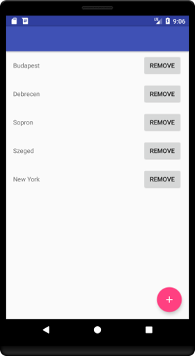
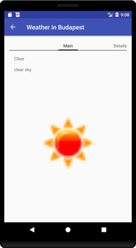
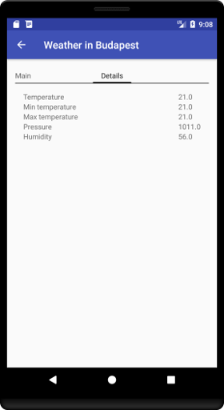

# Labor 07 - Weather Info alkalmazás készítése

## Bevezető

A labor során egy időjárás információkat megjelenítő alkalmazás elkészítése a feladat. A korábban látott UI elemek használata mellett láthatunk majd példát hálózati kommunkáció hatékony megvalósítására is a [`Retrofit`](https://square.github.io/retrofit/) library felhasználásával.

Az alkalmazás városok listáját jeleníti meg egy [`RecyclerView`](https://developer.android.com/guide/topics/ui/layout/recyclerview)-ban, egy kiválasztott város részletes időjárás adatait pedig az [OpenWeatherMap](https://openweathermap.org/) REST API-jának segítségével kérdezi le. A részletező nézeten egy [`ViewPager`](https://developer.android.com/training/animation/screen-slide)-ben két [`Fragment`](https://developer.android.com/guide/components/fragments)-en lehet megtekinteni a részleteket. Új város hozzáadására egy  [`FloatingActionButton`](https://developer.android.com/guide/topics/ui/floating-action-button) megnyomásával van lehetőség. 

> REST = [**Re**presentational **S**tate **T**ransfer](https://en.wikipedia.org/wiki/Representational_state_transfer)

<p align="center">



</p>

Felhasznált technológiák: 

- [`Activity`](https://developer.android.com/guide/components/activities/intro-activities)
- [`Fragment`](https://developer.android.com/guide/components/fragments)
- [`RecyclerView`](https://developer.android.com/guide/topics/ui/layout/recyclerview)
- [`ViewPager`](https://developer.android.com/training/animation/screen-slide)
- [`Retrofit`](https://square.github.io/retrofit/)
- [`Gson`](https://github.com/google/gson)
- [`Glide`](https://github.com/bumptech/glide)

## Feltöltés

Az elkészült megoldást `.zip` formátumban (File... -> Export to Zip File...) kell feltölteni a tárgy oldalán, ahol a laborvezető tudja értékelni.

## Az alkalmazás specifikációja

Az alkalmazás két `Activity`-ből áll. 

Az alkalmazás indulásakor megjelenő `Activity` a felhasználó által felvett városok listáját jeleníti meg. Minden lista elemhez tartozik egy *Remove* gomb, aminek a megnyomására az adott város törlődik a listából. Új várost a nézet jobb alsó sarkában található `FloatingActionButton` megnyomásával lehet felvenni.

Egy városra való kattintás hatására megnyílik egy új `Activity` két `Fragment`-tel, amik között `ViewPager`-rel lehet váltani. Az első `Fragment` a kiválasztott város időjárásának leírását és az ahhoz tartozó ikont jeleníti meg. A második `Fragment`-en a városban mért átlagos, minimum és maximum hőmérséklet, a légnyomás és a páratartalom értéke látható.

## Laborfeladatok

A labor során az alábbi feladatokat a laborvezető segítségével, illetve a jelölt feladatokat önállóan kell megvalósítani.

1. Város lista megvalósítása: 1 pont
2. Részletező nézet létrehozása és bekötése a navigációba: 1 pont
3. Hálózati kommunikáció megvalósítása: 1 pont
4. A hálózati réteg bekötése a részletező nézetbe: 1 pont
5. Önálló feladat: város listából törlés megvalósítása: 1 pont

A labor során egy komplex időjárás alkalmazás készül el. A labor szűkös időkerete miatt szükség lesz nagyobb kódblokkok másolására, azonban minden esetben figyeljünk a laborvezető magyarázatára, hogy a kódrészek érthetőek legyenek. A cél a bemutatott kódok megértése és a felhasznált libraryk használatának elsajátítása.

*Elnézést kérünk  az eddigieknél nagyobb kód blokkokért, de egy ilyen, bemutató jellegű feladat kisebb méretben nem oldható meg, illetve a labor elveszítené a lényegét, ha csak egy „hello world” hálózati kommunikációs lekérést valósítanánk meg. Köszönjük a megértést.*

### Projekt létrehozása

Hozzunk létre egy projektet Android Studioban. Az alkalmazást telefonra és tabletre készítjük, tehát válasszuk ki a **Phone and Tablet** lehetőséget, `No Activity` opcióval! Az alkalmazást `WeatherInfo` néven hozzuk létre, a *package name* legyen `hu.bme.aut.weatherinfo`!  minimum SDK-nak pedig válasszuk az alapértelmezett **API 21**-et! Első `Activity`-ként hozzunk létre egy *Basic Activityt*, és nevezzük el `CityActivity`-nek, legyen ez a **Launcher Activity**-nk majd kattintsunk a *Finish* gombra!

Mindenek előtt kapcsoljuk be a `ViewBinding`-ot. Ehhez az `app` modulhoz tartozó `build.gradle` fájlban az `android` blokkon belülre illesszük be az engedélyező kódrészletet (majd kattintsunk a jobb felül megjelenő `Sync Now` gombra).

```groovy
buildFeatures {
    viewBinding true
}
```

Töltsük le és tömörítsük ki [az alkalmazáshoz szükséges erőforrásokat](./assets/drawables.zip) , majd másoljuk be őket a projekt *app/src/main/res* mappájába (Studio-ban a *res* mappa kijelölése után *Ctrl+V*)!

Az *app* modulhoz tartozó `build.gradle` fájlban a `dependencies` blokkhoz adjuk hozzá a `Retrofit` és `Glide` libraryket:

```groovy
dependencies{
    //...
    def retrofit_version = "2.9.0"
    implementation "com.squareup.retrofit2:retrofit:$retrofit_version"
    implementation "com.squareup.retrofit2:converter-gson:$retrofit_version"
    implementation 'com.github.bumptech.glide:glide:4.12.0'
    annotationProcessor 'com.github.bumptech.glide:compiler:4.12.0'
}
```

Ezután kattintsunk a jobb felső sarokban megjelenő **Sync now** gombra.

>  A `Retrofit` a fejlesztő által leírt egyszerű, megfelelően annotált interfészek alapján kódgenerálással állít elő HTTP hivásokat lebonyolító implementációt. Kezeli az URL-ben inline módon adott paramétereket, az URL queryket, stb. Támogatja a legnépszerűbb szerializáló/deszerializáló megoldásokat is (pl.: [`Gson`](https://github.com/google/gson), [`Moshi`](https://github.com/square/moshi), [`Simple XML`](simple.sourceforge.net), stb.), amikkel Java/Kotlin objektumok, és JSON vagy XML formátumú adatok közötti kétirányú átalakítás valósítható meg. A laboron ezek közül a Gsont fogjuk használni a JSON-ban érkező időjárás adatok konvertálására.

> A `Glide`  egy hatékony képbetöltést és -cache-elést megvalósító library Androidra. Egyszerű interfésze és hatékonysága miatt használjuk.

Az alkalmazásban szükségünk lesz internet elérésre. Vegyük fel az `AndroidManifest.xml` állományban az *Internet permission*-t az `application` tagen *kívülre*:

```xml
<uses-permission android:name="android.permission.INTERNET" />
```

> Androidon API 23-tól (6.0, Marshmallow) az engedélyek két csoportba lettek osztva. A *normal* csoportba tartozó engedélyeket elég felvenni az `AndroidManifest.xml` fájlba az előbb látott módon és az alkalmazás automatikusan megkapja őket. A *dangerous* csoportba tartozó engedélyek esetén ez már nem elég, futás időben explicit módon el kell kérni őket a felhasználótól, aki akármikor meg is tagadhatja az alkalmazástól a kért engedélyt. Az engedélyek kezeléséről bővebben a [developer.android.com](https://developer.android.com/guide/topics/permissions/overview) oldalon lehet tájékozódni

Vegyük fel az alábbi szöveges erőforrásokat a `res/values/strings.xml`-be:

```xml
<resources>
    <string name="app_name">WeatherInfo</string>
    
    <string name="action_settings">Settings</string>
    
    <string name="title_activity_city">Cities</string>
    <string name="remove">Remove</string>
    
    <string name="new_city">New city</string>
   	<string name="new_city_hint">City</string>
    <string name="ok">OK</string>
    <string name="cancel">Cancel</string>
    
    <string name="title_activity_details">DetailsActivity</string>
    <string name="weather">Weather</string>
    <string name="temperature">Temperature</string>
    <string name="min_temperature">Min temperature</string>
    <string name="max_temperature">Max temperature</string>
    <string name="pressure">Pressure</string>
    <string name="humidity">Humidity</string>
    <string name="main">Main</string>
    <string name="details">Details</string>
</resources>

```

#### OpenWeatherMap API kulcs

Regisztráljunk saját felhasználót az [OpenWeatherMap](https://openweathermap.org/) oldalon, és hozzunk létre egy API kulcsot, aminek a segítségével használhatjuk majd a szolgáltatást az alkalmazásunkban! 

1. Kattintsunk a *Sign in* majd a *Create an account* gombra.
2. Töltsük ki a regisztrációs formot
3. A *Company* mező értéke legyen "BME", a *Purpose* értéke legyen "Education/Science"
4. Sikeres regisztráció után az *API keys* tabon található az alapértelmezettként létrehozott API kulcs.

A kapott API kulcsra később szükségünk lesz az időjárás adatokat lekérő API hívásnál.

### 1. Városlista megvalósítása (1 pont)

Valósítsuk meg az egy `RecyclerView`-ból álló, városok listáját megjelenítő `CityActivity`-t! 

A város nevére kattintva jelenik majd meg egy részletező nézet (*DetailsAcitivity*), ahol az időjárás információk letöltése fog történni. Új város felvételére egy *FloatingActionButton* fog szolgálni.

Cseréljük le az  `activity_city.xml` tartalmát egy `RecyclerView`-ra és egy `FloatingActionButton`-re:

```xml
<?xml version="1.0" encoding="utf-8"?>
<androidx.constraintlayout.widget.ConstraintLayout xmlns:android="http://schemas.android.com/apk/res/android"
    xmlns:app="http://schemas.android.com/apk/res-auto"
    xmlns:tools="http://schemas.android.com/tools"
    android:layout_width="match_parent"
    android:layout_height="match_parent"
    tools:context=".CityActivity">

    <androidx.recyclerview.widget.RecyclerView
        android:id="@+id/mainRecyclerView"
        android:layout_width="0dp"
        android:layout_height="0dp"
        app:layout_behavior="@string/appbar_scrolling_view_behavior"
        app:layout_constraintBottom_toBottomOf="parent"
        app:layout_constraintEnd_toEndOf="parent"
        app:layout_constraintStart_toStartOf="parent"
        app:layout_constraintTop_toTopOf="parent" />

    <com.google.android.material.floatingactionbutton.FloatingActionButton
        android:id="@+id/fab"
        android:layout_width="wrap_content"
        android:layout_height="wrap_content"
        android:layout_gravity="bottom|end"
        android:layout_margin="24dp"
        android:src="@drawable/ic_add_white_36dp"
        app:layout_constraintBottom_toBottomOf="parent"
        app:layout_constraintEnd_toEndOf="parent" />

</androidx.constraintlayout.widget.ConstraintLayout>
```

Az egyes funkciókhoz tartozó osztályokat külön package-ekbe fogjuk szervezni. Előfordulhat, hogy a másolások miatt az Android Studio nem ismeri fel egyből a package szerkezetet, így ha ilyen problémánk lenne, az osztály néven állva Alt+Enter után állítassuk be a megfelelő package nevet.

A `hu.bme.aut.weatherinfo` package-ben hozzunk létre egy `feature` nevű package-et. A `feature` package-ben hozzunk létre egy `city` nevű package-et. *Drag and drop* módszerrel helyezzük át a `CityActivity`-t a `city` *package*-be, a felugró dialógusban pedig kattintsunk a *Refactor* gombra.

Töröljük a generált két Fragment-et és a hozzájuk tartozó layout file-okat, valamint a res/navigation mappa tartalmát.

A `CityActivity` kódját cseréljük le a következőre:

```kotlin
class CityActivity : AppCompatActivity(), CityAdapter.OnCitySelectedListener,
    AddCityDialogFragment.AddCityDialogListener {

    private lateinit var binding: ActivityCityBinding
    private lateinit var adapter: CityAdapter

    override fun onCreate(savedInstanceState: Bundle?) {
        super.onCreate(savedInstanceState)
        binding = ActivityCityBinding.inflate(layoutInflater)
        setContentView(binding.root)
        initFab()
        initRecyclerView()
    }

    private fun initFab() {
        binding.fab.setOnClickListener {
            // TODO: Show new city dialog
        }
    }

    private fun initRecyclerView() {
        binding.mainRecyclerView.layoutManager = LinearLayoutManager(this)
        adapter = CityAdapter(this)
        adapter.addCity("Budapest")
        adapter.addCity("Debrecen")
        adapter.addCity("Sopron")
        adapter.addCity("Szeged")
        binding.mainRecyclerView.adapter = adapter
    }

    override fun onCitySelected(city: String?) {
        // Todo: Start DetailsActivity with the selected city
    }

    override fun onCityAdded(city: String?) {
        adapter.addCity(city!!)
    }
}
```

A `city` package-ben hozzuk létre a `CityAdapter` osztályt:

```kotlin
class CityAdapter(private val listener: OnCitySelectedListener) : RecyclerView.Adapter<CityAdapter.CityViewHolder>() {
    private val cities: MutableList<String> = ArrayList()

    interface OnCitySelectedListener {
        fun onCitySelected(city: String?)
    }

    override fun onCreateViewHolder(parent: ViewGroup, viewType: Int): CityViewHolder {
        val view = LayoutInflater.from(parent.context).inflate(R.layout.item_city, parent, false)
        return CityViewHolder(view)
    }

    override fun onBindViewHolder(holder: CityViewHolder, position: Int) {
        val item = cities[position]
        holder.bind(item)
    }

    override fun getItemCount(): Int = cities.size

    fun addCity(newCity: String) {
        cities.add(newCity)
        notifyItemInserted(cities.size - 1)
    }

    fun removeCity(position: Int) {
        cities.removeAt(position)
        notifyItemRemoved(position)
        if (position < cities.size) {
            notifyItemRangeChanged(position, cities.size - position)
        }
    }

    inner class CityViewHolder(private val itemView: View) : RecyclerView.ViewHolder(itemView) {
        var binding = ItemCityBinding.bind(itemView)
        var item: String? = null

        init {
            binding.root.setOnClickListener { listener.onCitySelected(item) }
        }

        fun bind(newCity: String?) {
            item = newCity
            binding.CityItemNameTextView.text = item
        }
    }
}
```

Hozzuk létre a `res/layout` mappában az  `item_city.xml` layoutot:

```xml
<?xml version="1.0" encoding="utf-8"?>
<LinearLayout xmlns:android="http://schemas.android.com/apk/res/android"
    xmlns:tools="http://schemas.android.com/tools"
    android:layout_width="match_parent"
    android:layout_height="wrap_content"
    android:orientation="horizontal"
    android:paddingBottom="8dp"
    android:paddingLeft="16dp"
    android:paddingRight="16dp"
    android:paddingTop="8dp"
    android:weightSum="3">

    <TextView
        android:id="@+id/CityItemNameTextView"
        android:layout_width="0dp"
        android:layout_height="wrap_content"
        android:layout_weight="2"
        tools:text="Budapest" />

    <Button
        android:id="@+id/CityItemRemoveButton"
        android:layout_width="0dp"
        android:layout_height="wrap_content"
        android:layout_weight="1"
        android:text="@string/remove" />

</LinearLayout>
```

Igény szerint vizsgáljuk meg a laborvezetővel a `CityAdapter` osztályban az alábbiakat:
- Hogyan történik a lista tartalmi elemeinek kezelése?
- Hogyan épül fel egy lista elem?
- Hogyan történik a lista elemen a kiválasztás események kezelése? Hogyan értesítjük a `CityActivity`-t egy elem kiválasztásáról?
- Hogyan kerültek megvalósításra az `addCity(...)` és `removeCity(…)` metódusok!

A `CityActivity`-vel kapcsolatos következő lépés az új város nevét bekérő dialógus (`DialogFragment`) megvalósítása és bekötése.

Hozzunk létre egy `dialog_new_city.xml` nevű layout fájlt a `res/layout` mappában a következő tartalommal:

```xml
<?xml version="1.0" encoding="utf-8"?>
<LinearLayout xmlns:android="http://schemas.android.com/apk/res/android"
    android:layout_width="match_parent"
    android:layout_height="match_parent"
    android:orientation="vertical"
    android:padding="24dp">

    <EditText
        android:id="@+id/NewCityDialogEditText"
        android:layout_width="match_parent"
        android:layout_height="wrap_content"
        android:hint="@string/new_city_hint"
        android:inputType="text" />

</LinearLayout>
```

A `city` package-ben hozzuk létre az `AddCityDialogFragment` osztályt:

```kotlin
class AddCityDialogFragment : AppCompatDialogFragment() {

    private lateinit var binding: DialogNewCityBinding
    private lateinit var listener: AddCityDialogListener

    interface AddCityDialogListener {
        fun onCityAdded(city: String?)
    }

    override fun onAttach(context: Context) {
        super.onAttach(context)
        binding = DialogNewCityBinding.inflate(LayoutInflater.from(context))
        
        try {
            listener = if (targetFragment != null) {
                targetFragment as AddCityDialogListener
            } else {
                activity as AddCityDialogListener
            }
        } catch (e: ClassCastException) {
            throw RuntimeException(e)
        }
    }

    override fun onCreateDialog(savedInstanceState: Bundle?): Dialog {
        return AlertDialog.Builder(requireContext())
            .setTitle(R.string.new_city)
            .setView(binding.root)
            .setPositiveButton(R.string.ok) { _, _ ->
                listener.onCityAdded(
                    binding.NewCityDialogEditText.text.toString()
                )
            }
            .setNegativeButton(R.string.cancel, null)
            .create()
    }
}
```

Igény szerint vizsgáljuk meg a laborvezetővel az `AddCityDialogFragment` implementációjában az alábbiakat:
- Hogyan ellenőrizzük azt, hogy az `Activity`, amihez a `DialogFragment` felcsatolódott implementálja-e az `AddCityDialogListener` interfészt?
- Hogyan kerül beállításra az egyedi layout a `DialogFragment`-ben?
- Hogyan térünk vissza a beírt városnévvel?

> Szorgalmi feladat otthonra: az alkalmazás ne engedje a város létrehozását, ha a városnév mező üres!
> Tipp: [http://stackoverflow.com/questions/13746412/prevent-dialogfragment-from-dismissing-when-button-is-clicked](http://stackoverflow.com/questions/13746412/prevent-dialogfragment-from-dismissing-when-button-is-clicked)

Végül egészítsük ki a `CityActivity` `initFab(…)` függvényét úgy, hogy a gombra kattintva jelenjen meg az új dialógus:

```kotlin
private fun initFab() {
    binding.fab.setOnClickListener {
            AddCityDialogFragment().show(supportFragmentManager, AddCityDialogFragment::class.java.simpleName)
    }
}
```

Indítsuk el az alkalmazást, amely már képes városnevek bekérésére és megjelenítésére.

### 2. Részletező nézet létrehozása és bekötése a navigációba (1 pont)

A következő lépésben a `hu.bme.aut.weatherinfo.feature`  package-en belül hozzunk létre egy `details` nevű packaget.

A `details` package-ben hozzunk létre egy *Empty Activity* típusú `Activity`-t  `DetailsActivity` néven.

A hozzá tartozó `activity_details.xml` layout kódja:

```xml
<?xml version="1.0" encoding="utf-8"?>
<LinearLayout xmlns:android="http://schemas.android.com/apk/res/android"
    android:layout_width="match_parent"
    android:layout_height="match_parent"
    android:orientation="vertical"
    android:paddingBottom="@dimen/activity_vertical_margin"
    android:paddingLeft="@dimen/activity_horizontal_margin"
    android:paddingRight="@dimen/activity_horizontal_margin"
    android:paddingTop="@dimen/activity_vertical_margin">

    <com.google.android.material.tabs.TabLayout 
        android:id="@+id/tabLayout"
        android:layout_width="match_parent"
        android:layout_height="wrap_content"
        android:layout_gravity="top" />

    <androidx.viewpager2.widget.ViewPager2
        android:id="@+id/mainViewPager"
        android:layout_width="match_parent"
        android:layout_height="0dp"
        android:layout_weight="1" />

</LinearLayout>
```

Hozzunk létre a hiányzó *dimen* erőforrásokat (*Alt+Enter* -> *Create dimen value...*), értékük legyen *16dp*!

A felület gyakorlatilag egy `ViewPager`-t tartalmaz, melyben két `Fragment`-et fogunk megjeleníteni. A `TabLayout` biztosítja a *Tab* jellegű fejlécet.

A `DetailsActivity.kt`  kódja legyen a következő:

```kotlin
class DetailsActivity : AppCompatActivity() {

    private lateinit var binding: ActivityDetailsBinding
    private var city: String? = null

    companion object {
        private const val TAG = "DetailsActivity"
        const val EXTRA_CITY_NAME = "extra.city_name"
    }

    override fun onCreate(savedInstanceState: Bundle?) {
        super.onCreate(savedInstanceState)
        binding = ActivityDetailsBinding.inflate(layoutInflater)
        setContentView(binding.root)

        city = intent.getStringExtra(EXTRA_CITY_NAME)

        supportActionBar?.title = getString(R.string.weather, city)
        supportActionBar?.setDisplayHomeAsUpEnabled(true)
    }

    override fun onResume() {
        super.onResume()
    }

    override fun onOptionsItemSelected(item: MenuItem): Boolean {
        if (item.itemId == android.R.id.home) {
            finish()
            return true
        }
        return super.onOptionsItemSelected(item)
    }
}
```

Cseréljük le a `strings.xml`-ben a *weather* szöveges erőforrást:

```xml
<string name="weather">Weather in %s </string>
```

A string erőforrásba írt *%s* jelölő használatával lehetővé válik egy *String argumentum* beillesztése a stringbe, ahogy a fenti kódrészletben láthatjuk.

> Figyeljük meg, hogy a `DetailsActivity` hogyan állítja be az `ActionBar` címét a paraméterül kapott város nevével, illetve és azt, hogy az `ActionBar` bal felső sarkában a *vissza gomb* kezelése hogyan került megvalósításra.

Valósítsuk meg a `CityActivity` `onCitySelected(…)` függvényében azt, hogy egy városnév kiválasztásakor a `DetailsActivity` megfelelően felparaméterezve induljon el:

```kotlin
    override fun onCitySelected(city: String?) {
        val showDetailsIntent = Intent()
        showDetailsIntent.setClass(this@CityActivity, DetailsActivity::class.java)
        showDetailsIntent.putExtra(DetailsActivity.EXTRA_CITY_NAME, city)
        startActivity(showDetailsIntent)
    }
```

Próbáljuk ki az alkalmazást, kattintsunk egy város nevére!

### 3. Hálózati kommunikáció megvalósítása (1 pont)

#### Modell osztályok létrehozása 

A modell osztályok számára a `hu.bme.aut.weatherinfo` package-ben hozzunk létre új package-et `model` néven. 

A `model` package-ben hozzunk létre egy új osztályt `WeatherData` néven:

```kotlin
data class WeatherData (
    var coord: Coord,
    var weather: List<Weather>? = null,
    var base: String,
    var main: MainWeatherData? = null,
    var visibility: Int,
    var wind: Wind? = null,
    var clouds: Cloud,
    var dt: Int,
    var sys: Sys,
    var timezone: Int,
    var id: Int,
    var name: String,
    var cod: Int
)
```

 Az időjárás szolgáltatástól kapott *JSON* válasz alapján egy ilyen `WeatherData` példány fog létrejönni a `Retrofit` és a `Gson` együttműködésének köszönhetően.

A `model` package-ben hozzuk létre a `Weather` osztályt:

```kotlin
data class Weather (
    val id: Long = 0,
    val main: String? = null,
    val description: String? = null,
    val icon: String? = null
)
```

Szintén a `model` package-ben hozzuk létre a `MainWeatherData` osztályt:

```kotlin
data class MainWeatherData (
    val temp: Float = 0f,
    val pressure: Float = 0f,
    val humidity: Float = 0f,
    val temp_min: Float = 0f,
    val temp_max: Float = 0f
)
```

Szintén a `model` package-ben hozzuk létre a `Coord` osztályt:

```kotlin
data class Coord (
    var lon: Float = 0f,
    var lat: Float = 0f
)
```

Szintén a `model` package-ben hozzuk létre a `Cloud` osztályt:

```kotlin
data class Cloud (
    var all: Int = 0
)
```

Szintén a `model` package-ben hozzuk létre a `Sys` osztályt:

```kotlin
data class Sys (
    var type: Int = 0,
    var id: Int = 0,
    var country: String? = null,
    var sunrise: Int = 0,
    var sunset: Int = 0
)
```

Végül hozzuk létre a `Wind` osztályt is:

```kotlin
class Wind (
    val speed: Float = 0f,
    val deg: Float = 0f
)
```

A `details` *package*-ben hozzuk létre a `WeatherDataHolder` interfészt:

```kotlin
interface WeatherDataHolder {
    fun getWeatherData(): WeatherData?
}
```

 A `WeatherDataHolder` -en keresztül fogják lekérni a `Fragment`-ek az `Activity`-től az időjárás adatokat.

Vegyünk fel egy `WeatherData` típusú tagváltozót a `DetailsActiviy`-be:

```kotlin
private var weatherData: WeatherData? = null
```

Módosítsuk úgy a `DetailsActivity` -t, hogy implementálja a `WeatherDataHolder` interfészt:

```kotlin
class DetailsActivity : AppCompatActivity(), WeatherDataHolder {
```

Implementáljuk a szükséges függvényt:

```kotlin
    override fun getWeatherData(): WeatherData? {
        return weatherData
    }
```

A használt `weatherData` változónak fogunk később értéket adni, amikor visszaérkezett az értéke a hálózati hívás eredményeként. A `ViewPager` két lapján levő `Fragment`-ek a `WeatherDataHolder` interfészen keresztül fogják lekérni az `Activity`-től a `weatherData` objekutmot a megjelenítéshez.

#### A hálózati réteg megvalósítása

A `hu.bme.aut.weatherinfo` package-ben hozzuk létre egy `network` nevű package-et, amely a hálózati kommunikációhoz kapcsolódó osztályokat fogja tartalmazni. 

A `network` package-en belül hozzuk létre egy `WeatherApi` nevű interfészt. 

```kotlin
interface WeatherApi {
    @GET("/data/2.5/weather")
    fun getWeather(
        @Query("q") cityName: String?,
        @Query("units") units: String?,
        @Query("appid") appId: String?
    ): Call<WeatherData?>?
}
```

Látható, hogy *annotációk* alkalmazásával tuduk jelezni, hogy az adott függvényhívás milyen hálózati hívásnak fog megfelelni. A `@GET` annotáció *HTTP GET* kérést jelent, a paraméterként adott string pedig azt jelzi, hogy hogy a szerver alap *URL*-éhez képest melyik végpontra szeretnénk küldeni a kérést.

> Hasonló módon tudjuk leírni a többi HTTP kérés típust is: @POST, @UPDATE, @PATCH, @DELETE

A függvény paremétereit a `@Query` annotációval láttuk el. Ez azt jelenti, hogy a `Retrofit` az adott paraméter értékét a kéréshez fűzi *query paraméterként* az annotációban megadott kulccsal.

> További említésre méltó annotációk a teljesség igénye nélkül: @HEAD, @Multipart, @Field

A hálózati hívást jelölő interfész függvény visszatérési értéke egy`Call<WeatherData>` típusú objektum lesz. Ez egy olyan hálózati hívást ír le, aminek a válasza `WeatherData` típusú objektummá alakítható.

Hozzunk létre a `network` package-ben egy `NetworkManager` osztályt:

```kotlin
object NetworkManager {
    private val retrofit: Retrofit
    private val weatherApi: WeatherApi

    private const val SERVICE_URL = "https://api.openweathermap.org"
    private const val APP_ID = "ide_jon_a_token"

    init {
        retrofit = Retrofit.Builder()
            .baseUrl(SERVICE_URL)
            .client(OkHttpClient.Builder().build())
            .addConverterFactory(GsonConverterFactory.create())
            .build()
        weatherApi = retrofit.create(WeatherApi::class.java)
    }

    fun getWeather(city: String?): Call<WeatherData?>? {
        return weatherApi.getWeather(city, "metric", APP_ID)
    }
}
```

Ez az osztály lesz felelős a hálózati kérések lebonyolításáért. Egyetlen példányra lesz szükségünk belőle, így [singleton](https://en.wikipedia.org/wiki/Singleton_pattern)ként implementáltuk. Konstansokban tároljuk a szerver alap címét, valamint a szolgáltatás használatához szükséges API kulcsot.

A `Retrofit.Builder()` hívással kérhetünk egy pareméterehzető `Builder` példányt. Ebben adhatjuk meg a hálózati hívásaink tulajdonságait. Jelen példában beállítjuk az elérni kívánt szolgáltatás címét, a HTTP kliens implementációt ([OkHttp](http://square.github.io/okhttp/)), valamint a JSON és objektum reprezentációk közötti konvertert (Gson).

A `WeatherApi` interfészből a `Builder`-rel létrehozott `Retrofit` példány segítségével tudjuk elkérni a fordítási időben generált, paraméterezett implementációt.

 A `retrofit.create(WeatherApi.class)` hívás eredményeként kapott objektum megvalósítja a `WeatherApi` interfészt.  Ha ezen az objektumon meghívjuk a `getWeather(...)` függvényt, akkor megtörténik az általunk az interfészben definiált hálózati hívás. 

Az `APP_ID` paramétert elfedjük az időjárást lekérdező osztályok elől, ezért a `NetworkManager` is tartalmaz egy `getWeather(...)` függvényt, ami a `WeatherApi` implementációba hív tovább.

**Cseréljük le** az `APP_ID` értékét az [OpenWeatherMap](https://openweathermap.org/) oldalon kapott saját API kulcsunkra!

### 4. A hálózati réteg bekötése a részletező nézetbe (1 pont)

A modell elemek és a hálózati réteg megvalósítása után a részletező nézetet fogjuk a specifikációnak megfelelően implementálni, majd bekötjük a hálózati réteget is.

#### A részletező nézetek továbbfejlesztése

A `ViewPager` megfelelő működéséhez létre kell hoznunk egy `FragmentStateAdapter`-ből származó osztályt a `details` package-ben, ami az eddig látott adapterekhez hasonlóan azt határozza meg, hogy milyen elemek jelenjenek meg a hozzájuk tartozó nézeten (jelen esetben az elemek `Fragment`-ek lesznek):

```kotlin
class DetailsPagerAdapter(fragmentActivity: FragmentActivity) : FragmentStateAdapter(fragmentActivity) {

    companion object {
        private const val NUM_PAGES: Int = 2
    }

    override fun createFragment(position: Int): Fragment {
        return when (position) {
            0 -> DetailsMainFragment()
            1 -> DetailsMoreFragment()
            else -> DetailsMainFragment()
        }
    }

    override fun getItemCount(): Int = NUM_PAGES
}
```

Implementáljuk a hiányzó `Fragment`-eket a hozzájuk tartozó nézetekkel együtt:

##### DetailsMainFragment

`res/layout/fragment_details_main.xml`:

```xml
<?xml version="1.0" encoding="utf-8"?>
<LinearLayout
    xmlns:android="http://schemas.android.com/apk/res/android"
    xmlns:tools="http://schemas.android.com/tools"
    android:layout_width="match_parent"
    android:layout_height="match_parent"
    android:orientation="vertical"
    android:padding="16dp">

    <TextView
        android:id="@+id/tvMain"
        android:layout_width="match_parent"
        android:layout_height="wrap_content"
        tools:text="Clear"/>

    <TextView
        android:id="@+id/tvDescription"
        android:layout_width="match_parent"
        android:layout_height="wrap_content"
        android:layout_marginTop="16dp"
        tools:text="Clear sky"/>

    <ImageView
        android:id="@+id/ivIcon"
        android:layout_width="match_parent"
        android:layout_height="match_parent"
        android:layout_marginTop="16dp"/>

</LinearLayout>
```

A `details` package-ben a `DetailsMainFragment`:

```kotlin
class DetailsMainFragment : Fragment() {

    private lateinit var binding: FragmentDetailsMainBinding
    private var weatherDataHolder: WeatherDataHolder? = null

    override fun onCreate(savedInstanceState: Bundle?) {
        super.onCreate(savedInstanceState)
        weatherDataHolder = if (activity is WeatherDataHolder) {
            activity as WeatherDataHolder?
        } else {
            throw RuntimeException(
                "Activity must implement WeatherDataHolder interface!"
            )
        }
    }

    override fun onCreateView(inflater: LayoutInflater, container: ViewGroup?, savedInstanceState: Bundle? ): View? {
        binding = FragmentDetailsMainBinding.inflate(LayoutInflater.from(context))
        return binding.root
    }

    override fun onViewCreated(view: View, savedInstanceState: Bundle?) {
        super.onViewCreated(view, savedInstanceState)
        if (weatherDataHolder?.getWeatherData() != null) {
            displayWeatherData()
        }
    }

    private fun displayWeatherData() {
        val weather = weatherDataHolder?.getWeatherData()?.weather?.first()
        binding.tvMain.text = weather?.main
        binding.tvDescription.text = weather?.description

        Glide.with(this)
            .load("https://openweathermap.org/img/w/${weather?.icon}.png")
            .transition(DrawableTransitionOptions().crossFade())
            .into(binding.ivIcon)
    }
}
```

Figyeljük meg, hogy hogy használjuk a kódban a `Glide` libraryt!

> Az *OpenWeatherMap* API-tól a képek lekérhetők a visszakapott adatok alapján, pl: [https://openweathermap.org/img/w/10d.png](http://openweathermap.org/img/w/10d.png) 

##### DetailsMoreFragment

`res/layout/fragment_details_more.xml`:

```xml
<?xml version="1.0" encoding="utf-8"?>
<TableLayout
    xmlns:android="http://schemas.android.com/apk/res/android"
    xmlns:tools="http://schemas.android.com/tools"
    android:layout_width="match_parent"
    android:layout_height="wrap_content"
    android:padding="16dp"
    android:stretchColumns="0">
    <TableRow>
        <TextView
            android:layout_width="wrap_content"
            android:layout_height="wrap_content"
            android:text="@string/temperature"/>
        <TextView
            android:id="@+id/tvTemperature"
            android:layout_width="wrap_content"
            android:layout_height="wrap_content"
            tools:text="25 °C"/>
    </TableRow>
    <TableRow>
        <TextView
            android:layout_width="wrap_content"
            android:layout_height="wrap_content"
            android:text="@string/min_temperature"/>
        <TextView
            android:id="@+id/tvMinTemp"
            android:layout_width="wrap_content"
            android:layout_height="wrap_content"
            tools:text="24 °C"/>
    </TableRow>
    <TableRow>
        <TextView
            android:layout_width="wrap_content"
            android:layout_height="wrap_content"
            android:text="@string/max_temperature"/>
        <TextView
            android:id="@+id/tvMaxTemp"
            android:layout_width="wrap_content"
            android:layout_height="wrap_content"
            tools:text="26 °C"/>
    </TableRow>
    <TableRow>
        <TextView
            android:layout_width="wrap_content"
            android:layout_height="wrap_content"
            android:text="@string/pressure"/>
        <TextView
            android:id="@+id/tvPressure"
            android:layout_width="wrap_content"
            android:layout_height="wrap_content"
            tools:text="100 Pa"/>
    </TableRow>
    <TableRow>
        <TextView
            android:layout_width="wrap_content"
            android:layout_height="wrap_content"
            android:text="@string/humidity"/>
        <TextView
            android:id="@+id/tvHumidity"
            android:layout_width="wrap_content"
            android:layout_height="wrap_content"
            tools:text="50 %"/>
    </TableRow>
</TableLayout>
```

A `details` package-ben a `DetailsMoreFragment`:

```kotlin
class DetailsMoreFragment : Fragment() {

    private lateinit var binding: FragmentDetailsMoreBinding
    private var weatherDataHolder: WeatherDataHolder? = null

    override fun onCreate(savedInstanceState: Bundle?) {
        super.onCreate(savedInstanceState)
        weatherDataHolder = if (activity is WeatherDataHolder) {
            activity as WeatherDataHolder?
        } else {
            throw RuntimeException("Activity must implement WeatherDataHolder interface!")
        }
    }

    override fun onCreateView(inflater: LayoutInflater, container: ViewGroup?, savedInstanceState: Bundle?): View? {
        binding = FragmentDetailsMoreBinding.inflate(LayoutInflater.from(context))
        return binding.root
    }

    override fun onViewCreated(view: View, savedInstanceState: Bundle?) {
        super.onViewCreated(view, savedInstanceState)
        if (weatherDataHolder?.getWeatherData() != null) {
            showWeatherData()
        }
    }

    private fun showWeatherData() {
        val weatherData = weatherDataHolder!!.getWeatherData()
        binding.tvTemperature.text = weatherData?.main?.temp.toString()
        binding.tvMinTemp.text = weatherData?.main?.temp_min.toString()
        binding.tvMaxTemp.text = weatherData?.main?.temp_max.toString()
        binding.tvPressure.text = weatherData?.main?.pressure.toString()
        binding.tvHumidity.text = weatherData?.main?.humidity.toString()
    }
}
```

Figyeljük meg, hogyan ellenőrzi a `DetailsMainFragment` és a `DetailsMoreFragment` azt, hogy az `Activity` implementálja-e a `WeatherDataHolder` interfészt. Fontos, hogy ezt a két `Fragment` majd csak azután kerül a `DetailsActivity`-re a `ViewPager`-en keresztül, amikor az adatokat lekérő hálózati kérés már adott vissza eredményt.

Ideiglenesen a `DetailsActivity` `onResume()` függvénye legyen az alábbi:


```kotlin
override fun onResume() {
    super.onResume()
    val detailsPagerAdapter = DetailsPagerAdapter(this)
    binding.mainViewPager.adapter = detailsPagerAdapter

    TabLayoutMediator(binding.tabLayout, binding.mainViewPager) { tab, position ->
        tab.text = when(position) {
            0 -> getString(R.string.main)
            1 -> getString(R.string.details)
            else -> ""
        }
    }.attach()
}
```

Próbáljuk ki az alkalmazást, kattintsunk egy városra! jelenleg még nem jelennek meg valós adatok, mivel még nem kötöttük be a az adatok lekéréséért felelős hívást.

#### Hálózati hívás bekötése

Az időjárás adatok lekérdezésének bekötéséhez implementáljunk egy `loadWeatherData()` nevű függvényt a `DetailsActivity`-ben:


```kotlin
private fun loadWeatherData() {
    NetworkManager.getWeather(city)?.enqueue(object : Callback<WeatherData?> {
        override fun onResponse(
            call: Call<WeatherData?>,
            response: Response<WeatherData?>
        ) {
            Log.d(TAG, "onResponse: " + response.code())
            if (response.isSuccessful) {
                displayWeatherData(response.body())
            } else {
                Toast.makeText(this@DetailsActivity, "Error: " + response.message(), Toast.LENGTH_LONG).show()
            }
        }

        override fun onFailure(
            call: Call<WeatherData?>,
            throwable: Throwable
        ) {
            throwable.printStackTrace()
            Toast.makeText(this@DetailsActivity, "Network request error occured, check LOG", Toast.LENGTH_LONG).show()
        }
    })
}
```

Implementáljuk a hiányzó `displayWeatherData(...)` függvényt, ami sikeres API hívás esetén megjeleníti az eredményt:

```kotlin
private fun displayWeatherData(receivedWeatherData: WeatherData?) {
    weatherData = receivedWeatherData
    val detailsPagerAdapter = DetailsPagerAdapter(this)
    binding.mainViewPager.adapter = detailsPagerAdapter
}
```

A `DetailsActivity` `onResume()` függvényében hívjuk meg a `loadWeatherData()` függvényt:

```kotlin
override fun onResume() {
    super.onResume()
    ...
    loadWeatherData()
}
```

Futtassuk az alkalmazást és figyeljük meg a működését! Próbáljuk ki azt is, hogy mi történik akkor, ha megszakítjuk a futtató eszköz internet kapcsolatát és megpróbáljuk megnyitni a részletező nézetet!

### 5. Önálló feladat: város listából törlés megvalósítása (1 pont)

Valósítsuk meg a városok törlését a *Remove* gomb megnyomásának hatására.
